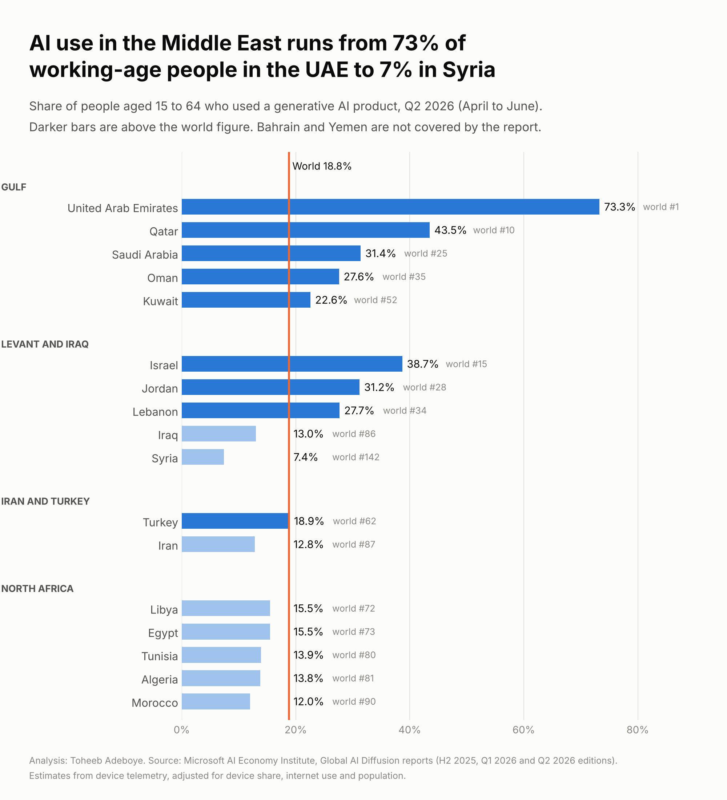
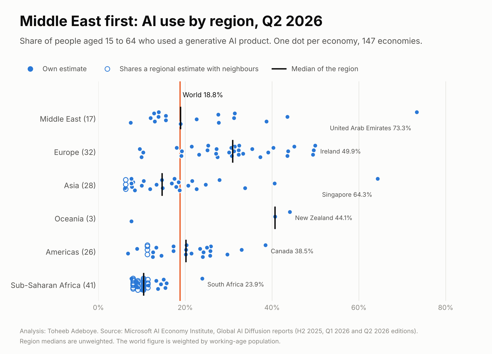
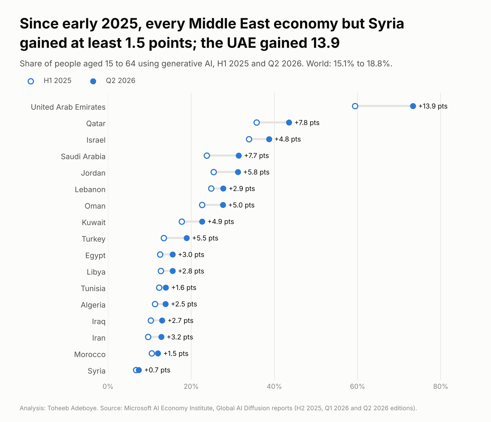

# AI Use by Country: the Middle East and the World

**How many working-age people use generative AI in each Middle East economy, and how does the region compare with the rest of the world?**

[Notebook](notebooks/ai_use_analysis.ipynb) · [SQL](sql/analysis_queries.sql) · [Data dictionary](docs/data_dictionary.md) · [Economy table](data/processed/ai_use_by_economy.csv)



## Contents

1. [Project background](#project-background)
2. [Questions](#questions)
3. [Executive summary](#executive-summary)
4. [Insights](#insights)
5. [Recommendations](#recommendations)
6. [Data](#data)
7. [Method](#method)
8. [Tools](#tools)
9. [Repository structure](#repository-structure)
10. [How to reproduce](#how-to-reproduce)
11. [Assumptions and limitations](#assumptions-and-limitations)
12. [Sources](#sources)
13. [Author](#author)

## Project background

Companies that sell AI products, hire for AI skills or train staff need to know how many people in a market already use these tools. The Microsoft AI Economy Institute publishes an estimate of the share of people aged 15 to 64 who used a generative AI product in each of 147 economies. Its Q2 2026 edition, published in September 2026, covers April to June 2026.

This project collects the full country tables from the three latest editions (H2 2025, Q1 2026 and Q2 2026), which together give four periods from the first half of 2025 to the second quarter of 2026. Results for the Middle East are shown first, then the other regions.

## Questions

1. How many working-age people use generative AI in each Middle East economy, and how wide is the range inside the region?
2. How does each Middle East sub-region compare with the world figure and with other regions?
3. How fast has use grown since the first half of 2025?
4. For which economies is the figure a country estimate, and for which is it a shared regional estimate?

## Executive summary

In Q2 2026, 73.3% of working-age people in the United Arab Emirates used a generative AI product, the highest share of the 147 economies covered and 3.9 times the world figure of 18.8%. Inside the Middle East the range is wide: Qatar is 10th in the world at 43.5%, while Syria is at 7.4%. All five Gulf economies in the report are above the world figure, and their median (31.4%) is slightly above the European median (31.0%). All five North African economies are below it, between 12.0% and 15.5%. Use rose in every Middle East economy except Syria between Q1 and Q2 2026.

| Measure | Value | Checked in |
|---|---|---|
| World share of working-age people using generative AI, Q2 2026 | 18.8% | Five documents |
| United Arab Emirates, Q2 2026, world rank 1 | 73.3% | Five documents, four publishers |
| Qatar, Q2 2026, world rank 10 | 43.5% | Three documents, three publishers |
| Syria, Q2 2026, lowest in the Middle East | 7.4% | One document (Q1 2026 value of 7.5% in two reports) |
| Gulf economies above the world figure | 5 of 5 | Derived |
| North African economies above the world figure | 0 of 5 | Derived |
| United Arab Emirates, gain from H1 2025 to Q2 2026 | +13.9 points (59.4% to 73.3%) | Derived from figures in two reports |



## Insights

### 1. The range inside the Middle East is wider than the gap between most regions

| Sub-region | Economies | Median, Q2 2026 | Highest | Lowest |
|---|---|---|---|---|
| Gulf | 5 | 31.4% | United Arab Emirates 73.3% | Kuwait 22.6% |
| Levant and Iraq | 5 | 27.7% | Israel 38.7% | Syria 7.4% |
| Iran and Turkey | 2 | 15.9% | Turkey 18.9% | Iran 12.8% |
| North Africa | 5 | 13.9% | Libya 15.5% | Morocco 12.0% |
| Middle East, all | 17 | 18.9% | United Arab Emirates 73.3% | Syria 7.4% |

The top Middle East economy and the bottom one are 65.9 points apart. Four Middle East economies are in the world top 30: the United Arab Emirates (1), Qatar (10), Saudi Arabia (25) and Jordan (28). Israel is 15th.

### 2. The Gulf sits with Europe; North Africa sits near the Asian median

| Group | Economies | Median, Q2 2026 | Above the world figure (18.8%) |
|---|---|---|---|
| Middle East | 17 | 18.9% | 9 |
| Middle East: Gulf | 5 | 31.4% | 5 |
| Middle East: North Africa | 5 | 13.9% | 0 |
| Europe | 32 | 31.0% | 28 |
| Asia | 28 | 14.7% | 8 |
| Oceania | 3 | 40.7% | 2 |
| Americas | 26 | 20.2% | 14 |
| Sub-Saharan Africa | 41 | 10.4% | 1 |

Medians count each economy once. The world figure is weighted by working-age population, so it is pulled towards large economies such as India (18.5%) and China (17.5%).

Outside the Middle East the leaders are Singapore (64.3%, rank 2), Ireland (49.9%), France (49.6%), Norway (49.4%), New Zealand (44.1%), Canada (38.5%) and the United States (33.0%, rank 21). In Sub-Saharan Africa, South Africa leads at 23.9%, the only economy in the region above the world figure.

### 3. Use is rising almost everywhere, and fastest at the top



| Economy | H1 2025 | Q2 2026 | Change, points |
|---|---|---|---|
| United Arab Emirates | 59.4% | 73.3% | +13.9 |
| Qatar | 35.7% | 43.5% | +7.8 |
| Saudi Arabia | 23.7% | 31.4% | +7.7 |
| Jordan | 25.4% | 31.2% | +5.8 |
| Turkey | 13.4% | 18.9% | +5.5 |
| Egypt | 12.5% | 15.5% | +3.0 |
| Morocco | 10.5% | 12.0% | +1.5 |
| Syria | 6.7% | 7.4% | +0.7 |
| World | 15.1% | 18.8% | +3.7 |

Between Q1 and Q2 2026, the largest gains among all 147 economies were South Korea (+3.5 points), the United Arab Emirates (+3.2), Japan (+2.2), and Saudi Arabia and Taiwan (+2.0 each). Saudi Arabia moved from 30th to 25th. Only two economies fell, each by 0.1 point: Syria and Papua New Guinea. Across the 111 economies with their own estimate, those that started highest gained the most: the top quarter by H1 2025 level gained a median 6.2 points to Q2 2026, the bottom quarter 1.9 points. The gap is widening, as the report also finds for the Global North (28.8%) and Global South (16.2%).

### 4. One in four figures is a regional estimate, not a country figure

Thirty-six of the 147 economies have exactly the same value as their neighbours in every period. That pattern means the report applies one regional estimate to all of them. The six groups are:

| Group | Economies | Q2 2026 |
|---|---|---|
| Angola, Madagascar, Malawi, Mozambique | 4 | 11.4% |
| French Guiana, Guyana, Suriname, Venezuela | 4 | 11.3% |
| West Africa, including Nigeria and Ghana | 12 | 10.4% |
| Central Africa, including Cameroon and DR Congo | 5 | 9.1% |
| East Africa, including Ethiopia, Sudan and Tanzania | 8 | 8.0% |
| Afghanistan, Tajikistan, Turkmenistan | 3 | 6.3% |

Twenty-nine of the 41 Sub-Saharan African economies carry a shared estimate. All 17 Middle East economies have their own figure.

## Recommendations

**For companies launching AI products or AI features in the region:** treat the Gulf and North Africa as two different markets. In the United Arab Emirates and Qatar, most working-age people already use these tools, so the task is to win users from other products. In Egypt, Morocco, Algeria and Tunisia, between one working-age person in six and one in eight uses them, so the task is to bring in first-time users: simple onboarding, Arabic and French language support and low-cost plans.

**For employers and HR teams in the Gulf:** in the UAE and Qatar many new hires will already use AI tools. Workplace policies, approved tools and training on safe use are needed from the first day, not as a later project.

**For training providers and education businesses:** Iraq, Syria, Iran and the five North African economies have large working-age populations with use rates between 7% and 16%. That is the largest pool of people in the region who have not yet started.

**For analysts using this index for Sub-Saharan Africa:** do not rank Nigeria, Ghana, Ethiopia or the other 26 economies with a shared estimate against each other. Use the regional figure, and look for national survey data before making a country decision.

## Data

| File | Rows | Contents |
|---|---|---|
| `data/raw/ai_diffusion_readings.csv` | 1,084 | Every figure collected: one row per economy, period and document, with link |
| `data/raw/aggregate_readings.csv` | 48 | World, Global North and Global South figures, one row per period and document |
| `data/processed/ai_use_tidy.csv` | 588 | Long format: one row per economy and period, with region and verification label |
| `data/processed/ai_use_by_economy.csv` | 147 | One row per economy: four periods, ranks, changes, estimate type |
| `data/processed/region_summary.csv` | 11 | Medians, highest and lowest by region and Middle East sub-region |
| `data/processed/world_aggregates.csv` | 4 | World, Global North and Global South by period |
| `data/processed/source_checks.csv` | 4 | Count of figures by period and verification label |

Coverage: 147 economies in four periods. Middle East 17 (Gulf 5, Levant and Iraq 5, North Africa 5, Iran and Turkey 2), Europe 32, Asia 28, Oceania 3, Americas 26, Sub-Saharan Africa 41. Bahrain, Yemen and Palestine are not in the report.

Checks done by `scripts/build_data.py`, which stops with an error if any fails:

- No missing values, no duplicate reading from one document, only the four expected periods, every share between 0 and 100.
- Every economy has a value for all four periods and is assigned to exactly one region.
- Every figure printed by more than one document is the same in all of them. The only differences allowed are revisions of at most 0.1 point between two Microsoft reports. There are four, all for Q1 2026 (Algeria, Cambodia, Gambia, Ukraine); the later report's value is used.
- In each report, the printed order of economies follows the values from highest to lowest, ranks 1 to 147.
- The world, Global North and Global South figures agree in every document that prints them.

How each figure is confirmed (`source_checks.csv`): H1 2025, H2 2025 and Q1 2026 values are printed in two Microsoft reports for all 147 economies. Q2 2026 values are printed only in the Q2 2026 report; 20 of them are also printed by a second publisher, and the full table was transcribed twice with identical results.

## Method

The shares are the published estimates. Nothing is estimated or interpolated in this project. Derived measures:

```
change_q1_to_q2_pp            = q2_2026_pct - q1_2026_pct
change_h1_2025_to_q2_2026_pp  = q2_2026_pct - h1_2025_pct
multiple_of_world             = economy share / world share
median by region              = middle value of the economies in the region, each counted once

Example, United Arab Emirates:  73.3 - 59.4 = +13.9 points;  73.3 / 18.8 = 3.9 times
```

Shared regional estimates are found by a rule: an economy whose value equals another economy's value in all four periods is placed in a shared-value group.

Sensitivity check: using the median of all 147 economies (15.4%) instead of the world figure (18.8%) as the benchmark, 11 of 17 Middle East economies are above it instead of 9. All five Gulf economies are above both benchmarks. Two North African economies (Libya and Egypt, 15.5%) are just above the 147-economy median and none are above the world figure.

## Tools

- Python (pandas) for the build script and checks
- matplotlib for the charts
- SQL (SQLite) for the queries in `sql/analysis_queries.sql`
- Jupyter notebook for the walk-through

## Repository structure

```
ai-use-by-country/
  README.md
  requirements.txt
  data/raw/ai_diffusion_readings.csv
  data/raw/aggregate_readings.csv
  data/processed/ai_use_tidy.csv
  data/processed/ai_use_by_economy.csv
  data/processed/region_summary.csv
  data/processed/world_aggregates.csv
  data/processed/source_checks.csv
  notebooks/ai_use_analysis.ipynb
  scripts/build_data.py
  scripts/make_charts.py
  sql/analysis_queries.sql
  images/
  docs/data_dictionary.md
```

## How to reproduce

```
pip install -r requirements.txt
python scripts/build_data.py     # checks the raw readings and writes data/processed
python scripts/make_charts.py    # writes the charts to images/
jupyter notebook notebooks/ai_use_analysis.ipynb
```

To run the SQL, load `ai_use_by_economy.csv` as table `ai_use_by_economy` and `ai_use_tidy.csv` as table `ai_use_tidy` in SQLite.

## Assumptions and limitations

- **These are modelled estimates, not a survey.** Microsoft builds them from anonymised telemetry on its own products and adjusts for device and operating-system market share, internet use and population. Where Windows and Microsoft products have a small share, or where telemetry is limited, the estimate leans more on those adjustments. National surveys that ask people directly give different numbers, often higher, because they use other age ranges and questions.
- **Q2 2026 rests mostly on one document.** 127 of the 147 Q2 2026 figures, including every Middle East figure except the UAE, Qatar, Israel and Saudi Arabia, are printed only in the Q2 2026 report. News articles that repeat a Microsoft figure confirm that it was transcribed correctly; they are not independent measurements.
- **Thirty-six economies carry a shared regional estimate.** Their values say nothing about differences between them.
- **Small revisions between editions.** Four Q1 2026 values were revised by 0.1 point in the Q2 2026 report. Later editions may revise Q2 2026 in the same way.
- **Ties and ranks.** Several economies share a value to one decimal place. Saudi Arabia and Italy are both at 31.4%, and Qatar and the Netherlands both at 43.5%; the rank between them follows the report's order.
- **Regional groupings are this project's choice.** The Middle East here covers 17 economies in the report. Sudan and Mauritania, which are sometimes counted in the Middle East and North Africa, are placed in Sub-Saharan Africa because the report gives them a shared Sub-Saharan regional estimate.
- **Use is not depth of use.** The measure counts people who used a generative AI product in the period, not how often or for what.

## Sources

- Microsoft AI Economy Institute, [Global AI Diffusion Q2 2026](https://www.microsoft.com/en-us/research/wp-content/uploads/2026/09/Microsoft-AI-Diffusion-Report-2026-Q2.pdf), September 2026
- Microsoft AI Economy Institute, [Global AI Diffusion Report 2026 Q1](https://www.microsoft.com/en-us/research/wp-content/uploads/2026/05/Microsoft-AI-Diffusion-Report-2026-Q1.pdf), May 2026
- Microsoft AI Economy Institute, [Global AI Adoption in 2025 (H2 2025)](https://www.microsoft.com/en-us/research/wp-content/uploads/2026/01/Microsoft-AI-Diffusion-Report-2025-H2.pdf), January 2026
- Method paper: Misra, Wang, McCullers, White and Lavista Ferres, [Measuring AI Diffusion: A Population-Normalized Metric for Tracking Global AI Usage](https://arxiv.org/html/2511.02781v1), arXiv 2511.02781
- Second publishers: [The Peninsula Qatar](https://thepeninsulaqatar.com/article/27/09/2026/qatar-secures-top-10-spot-in-latest-global-ai-diffusion-ranking), [Middle East AI News](https://www.middleeastainews.com/p/uae-retains-top-world-ai-use-ranking), [Microsoft Source EMEA](https://news.microsoft.com/source/emea/2026/09/new-microsoft-data-ai-adoption-continues-to-rise-switzerland-remains-well-above-the-global-average/), [Pebblous](https://blog.pebblous.ai/report/microsoft-ai-diffusion-denominator-2026-09/en/), [Government of Jordan](https://jordan.gov.jo/AR//NewsDetails/Jordan_Ranks_Third_in_the_Arab_World_and_29th_Globally_in_the_AI_Diffusion_Index), [Follow ICT](https://followict.news/microsoft-ai-diffusion-report-highlights-egypts-growing-ai-momentum/), [Microsoft On the Issues](https://blogs.microsoft.com/on-the-issues/2026/05/07/the-state-of-global-ai-diffusion-in-2026/), [Enterprise DNA](https://enterprisedna.co/resources/news/microsoft-ai-diffusion-q1-2026-adoption-gap)

## Author

**Toheeb Adeboye**, Data Analyst, Doha, Qatar. [LinkedIn](https://www.linkedin.com/in/dtsquarea/)
