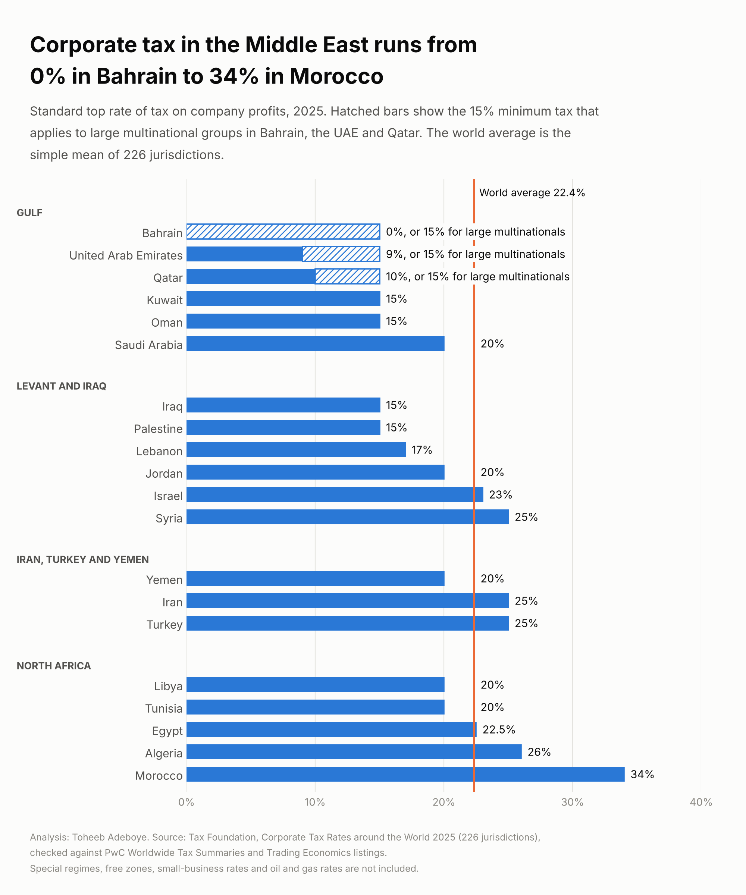
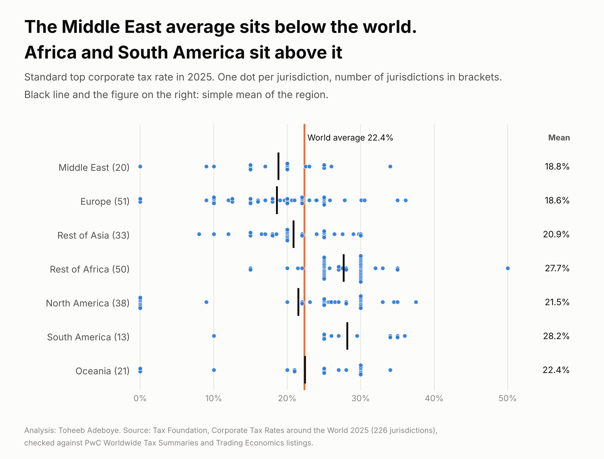
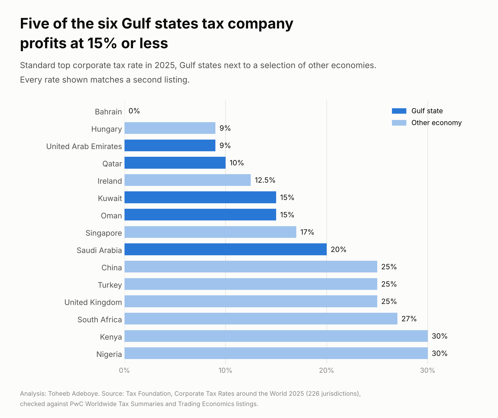

# Corporate Tax Rates by Country

**What rate of tax does a company pay on its profits in each Middle East economy, and how does the region compare with the rest of the world?**

[Notebook](notebooks/corporate_tax_analysis.ipynb) · [SQL queries](sql/analysis_queries.sql) · [Data dictionary](docs/data_dictionary.md) · [Tidy data](data/processed/corporate_tax_tidy.csv)



## Contents

1. [Project background](#project-background)
2. [Questions](#questions)
3. [Executive summary](#executive-summary)
4. [Insights](#insights)
5. [Recommendations](#recommendations)
6. [Data](#data)
7. [Method](#method)
8. [Tools](#tools)
9. [Repository structure](#repository-structure)
10. [How to reproduce](#how-to-reproduce)
11. [Assumptions and limitations](#assumptions-and-limitations)
12. [Sources](#sources)
13. [Author](#author)

## Project background

A company choosing where to register, open a branch or book its profits looks at the corporate income tax rate early. The rate is public in every country, but it sits in 226 different places and under different definitions. The Tax Foundation collects the standard top rate for 226 jurisdictions each year. This project takes the 2025 edition, puts the 20 Middle East economies first, and sets them against every other region. Each rate is then checked against two listings read in October 2026 to see which figures still hold.

## Questions

1. What is the standard corporate tax rate in each Middle East economy?
2. How do the Gulf, the Levant, North Africa and the rest of the region compare with the world average?
3. What changes for large multinational groups now that a 15% minimum tax applies in several Gulf states?
4. How does the Middle East compare with Europe, Asia, Africa, the Americas and Oceania?
5. How many of the 226 rates can be confirmed in a second source?

## Executive summary

The six Gulf states tax company profits at between 0% and 20%, with a simple mean of 11.5%. The mean of all 226 jurisdictions is 22.35%. Across the whole Middle East the mean is 18.82% and 13 of the 20 economies sit below the world mean. For large multinational groups the picture is narrower: Bahrain, the UAE and Qatar apply a 15% minimum tax, so every Gulf state is at 15% or 20% for those groups.

| Measure | Value |
|---|---|
| Jurisdictions in the table | 226 |
| World mean rate, 2025 | 22.35% |
| Middle East mean rate (20 economies) | 18.82% |
| Gulf mean rate (6 states) | 11.5% |
| Gulf mean rate for large multinational groups, with the 15% minimum tax | 15.83% |
| Lowest and highest rate in the Middle East | 0% (Bahrain), 34% (Morocco) |
| Middle East economies below the world mean | 13 of 20 |
| Rates confirmed in a second listing | 150 of 226 (16 of 20 in the Middle East) |



## Insights

### 1. The Gulf has the lowest rates in the region, from 0% to 20%

| Gulf state | Rate, 2025 | Rate for large multinational groups |
|---|---|---|
| Bahrain | 0% | 15% |
| United Arab Emirates | 9% | 15% |
| Qatar | 10% | 15% |
| Kuwait | 15% | 15% |
| Oman | 15% | 15% |
| Saudi Arabia | 20% | 20% |

Five of the six states are at 15% or less. Among jurisdictions that tax company profits at all, only Turkmenistan (8%) has a lower rate than the UAE. Barbados and Hungary share the UAE's 9%.

### 2. The 15% minimum tax narrows the Gulf range for large groups

Bahrain, the UAE and Qatar apply a 15% domestic minimum top-up tax to large multinational groups (the UAE rule covers groups with consolidated revenue of EUR 750 million or more, from 1 January 2025). With it, the Gulf range for those groups moves from 0% to 20% to 15% to 20%, and the mean moves from 11.5% to 15.83%. Smaller and domestic companies stay on the standard rate.

### 3. Outside the Gulf, the region sits close to the world mean

| Sub-region | Economies | Mean rate | Lowest | Highest |
|---|---|---|---|---|
| Gulf | 6 | 11.5% | 0% Bahrain | 20% Saudi Arabia |
| Levant and Iraq | 6 | 19.17% | 15% Iraq, Palestine | 25% Syria |
| Iran, Turkey and Yemen | 3 | 23.33% | 20% Yemen | 25% Iran, Turkey |
| North Africa | 5 | 24.5% | 20% Libya, Tunisia | 34% Morocco |

Iraq and Palestine match Kuwait and Oman at 15%. Morocco's 34% is shared with three other jurisdictions, and only 11 of the 226 have a higher rate.

### 4. The Middle East and Europe have the lowest regional means

| Region | Jurisdictions | Mean rate | Lowest | Highest |
|---|---|---|---|---|
| Middle East | 20 | 18.82% | 0% | 34% |
| Europe | 51 | 18.59% | 0% | 36.13% |
| Rest of Asia | 33 | 20.87% | 8% | 30% |
| Rest of Africa | 50 | 27.67% | 15% | 50% |
| North America | 38 | 21.52% | 0% | 37.5% |
| South America | 13 | 28.19% | 10% | 36% |
| Oceania | 21 | 22.43% | 0% | 34% |

The means are simple averages of jurisdictions, so a small island with a 0% rate counts as much as a large economy. Europe and North America include several such territories.

### 5. Gulf rates next to economies a company might compare them with



Every rate in this chart matches a second listing.

### 6. Two thirds of the rates can be confirmed in a second listing

| Status | Jurisdictions | Meaning |
|---|---|---|
| confirmed | 150 | The 2025 rate equals the PwC or the Trading Economics figure |
| differs | 22 | A second figure exists and is different |
| single-source | 54 | Neither listing covers the jurisdiction |

In the Middle East, 16 of 20 are confirmed. Yemen (20%) and Iran (25%) rest on the Tax Foundation table alone. Syria is 25% in the table and 28% in Trading Economics. Morocco is 34% for 2025 and 35% in both 2026 listings, which is a scheduled change of rate and not a disagreement about 2025.

## Recommendations

**For founders and finance teams choosing a base in the region:** use the standard rate as a first filter only. The spread inside the Gulf is 20 points for a small company and 5 points for a group above the minimum-tax threshold, so the answer depends on the size of the group.

**For multinational groups with revenue near EUR 750 million:** model both rates. In Bahrain, the UAE and Qatar the 15% rate applies once the threshold is crossed.

**For analysts comparing regions:** state which world average is used. The Middle East is below the simple mean (22.35%), the 181-jurisdiction mean (23.58%) and the GDP-weighted mean (26.04%), but the number of economies below the line changes from 13 to 15 to 19.

**For anyone reusing this table:** filter on `check_status = 'confirmed'` when a figure will be quoted, and check the current rate with a tax adviser or the national tax authority before a decision.

## Data

| File | Rows | Content |
|---|---|---|
| `data/raw/tax_foundation_2025_reading_a.csv` | 226 | Code, name, 2025 rate and rate with the minimum tax, first reading of the table |
| `data/raw/tax_foundation_2025_reading_b.csv` | 226 | Code, continent and 2025 rate, second reading of the same table |
| `data/raw/tax_foundation_2025_published_checks.csv` | 18 | Totals and averages printed in the Tax Foundation text |
| `data/raw/pwc_quick_chart_2026.csv` | 146 | PwC headline rate text and review date for each territory |
| `data/raw/trading_economics_2026.csv` | 162 | Trading Economics latest and previous rate (160 countries and two euro aggregates) |
| `data/processed/corporate_tax_tidy.csv` | 226 | One row per jurisdiction: region, rates, ranks, second-source figures, check status |
| `data/processed/region_summary.csv` | 12 | Seven regions, four Middle East sub-regions and the world |
| `data/processed/published_checks.csv` | 18 | Published totals next to the values recomputed from the table |

Coverage: 226 jurisdictions. Middle East 20 (Gulf 6, Levant and Iraq 6, Iran, Turkey and Yemen 3, North Africa 5), Europe 51, Rest of Asia 33, Rest of Africa 50, North America 38, South America 13, Oceania 21.

Checks done:

- The table was read twice and the two readings agree on all 226 rates.
- No duplicate codes. One missing value: the minimum-tax rate for Poland, which was cut off in the page. It is left empty.
- The mean of the 226 rates is 22.35%, the figure the Tax Foundation prints.
- The counts of jurisdictions with no corporate tax (15), at or below 20% (80), above 20% to 30% (126), above 30% to 35% (16) and above 35% (4) all match the published text.
- Every PwC and Trading Economics name is matched to a code, or the build stops.

## Method

Descriptive comparison of statutory rates. Regional figures are simple (unweighted) means of jurisdictions.

```
mean rate of a region  = sum of rate_2025_pct in the region / number of jurisdictions in the region
rate for large groups  = rate_with_min_tax_2025_pct   (the higher of the standard rate and the 15% minimum, where a top-up tax applies)
check_status           = confirmed      if rate_2025_pct equals the PwC or the Trading Economics figure
                         differs        if a second figure exists and none is equal
                         single-source  if neither listing covers the jurisdiction
```

The PwC chart gives text, not a number. A rate is taken from it only when the text is a single figure, a figure followed by a note in brackets, or one of 15 cases written out in the build script (for example Bahrain: "46 for oil corps; 0 for other corps").

## Tools

Python (pandas, matplotlib), SQL (SQLite).

## Repository structure

```
corporate-tax-rates-by-country/
  README.md
  requirements.txt
  data/raw/                  two readings of the Tax Foundation table, PwC and Trading Economics listings
  data/processed/            tidy table, region summary, published checks
  notebooks/                 corporate_tax_analysis.ipynb, executed
  scripts/                   build_data.py, make_charts.py
  sql/                       analysis_queries.sql
  images/                    three charts
  docs/data_dictionary.md
```

## How to reproduce

```
pip install -r requirements.txt
python scripts/build_data.py
python scripts/make_charts.py
```

The build stops if the two readings disagree, if a name cannot be matched, or if a published total does not match the table. The SQL file runs on `data/processed/corporate_tax_tidy.csv` loaded as table `corporate_tax`.

## Assumptions and limitations

- The rate is the standard top statutory rate for domestic companies in 2025. It is not the tax a given company pays. Free zones, incentives, small-business rates, withholding taxes and sector rates (oil and gas, banking) are outside the table.
- Ownership rules are not shown. In Saudi Arabia, one secondary source states that the 20% rate applies to the share of profit belonging to non-Saudi, non-GCC shareholders, and that Saudi and GCC shareholders pay zakat of 2.5% on a different base. Similar rules exist elsewhere in the Gulf and were not verified here.
- The UAE's 9% applies to taxable income above AED 375,000 (one secondary source). Below that the rate is 0%.
- The Tax Foundation counts surcharges and local taxes in a combined rate. That is why its figures for France (36.13%, including a 2025 surcharge on large companies), Portugal, Germany, Italy, Japan and the United States differ from the central rates in the two listings.
- The two listings were read in October 2026, so a match also means the rate has not changed since 2025. They are compilations of national law, like the Tax Foundation table, and may share sources. A match shows the figure was transcribed correctly and is in current use. It is not an independent measurement.
- The minimum-tax rates come from the Tax Foundation table. The 15% figure is also stated by PwC for Bahrain and by a second source for the UAE. For Qatar it rests on the Tax Foundation table alone.
- Yemen and Iran are single-source. Syria has two different figures (25% and 28%).
- Region means here use all jurisdictions in the table. The Tax Foundation's own regional means use the 181 jurisdictions with GDP data and group by continent, so they differ (for example Asia 19.74%, Africa 27.18%).
- The 2026 edition of the source is expected in December 2026. Known changes since 2025 include Morocco (35%), Lithuania (17%) and Cyprus (15%).
- This is a data summary, not tax advice.

## Sources

- Tax Foundation, [Corporate Tax Rates around the World, 2025](https://taxfoundation.org/data/all/global/corporate-tax-rates-by-country-2025/), December 2025.
- PwC, Worldwide Tax Summaries, [Corporate income tax (CIT) rates quick chart](https://taxsummaries.pwc.com/quick-charts/corporate-income-tax-cit-rates), read 9 October 2026.
- Trading Economics, [Corporate tax rate by country](https://tradingeconomics.com/country-list/corporate-tax-rate), read 9 October 2026.
- Alvarez & Marsal, [note on the UAE domestic minimum top-up tax](https://www.alvarezandmarsal.com/node/78226), 9 December 2024.
- Emerhub, [Corporate tax in Saudi Arabia](https://emerhub.com/saudi-arabia/corporate-tax-in-saudi-arabia-tax-rate-wht-and-exemptions/), November 2025.
- Velmont Crest, [GCC tax comparison](https://velmontcrest.ae/insights/gcc-tax-comparison/), July 2026.

## Author

**Toheeb Adeboye**, Data Analyst, Doha, Qatar. [LinkedIn](https://www.linkedin.com/in/dtsquarea/)
