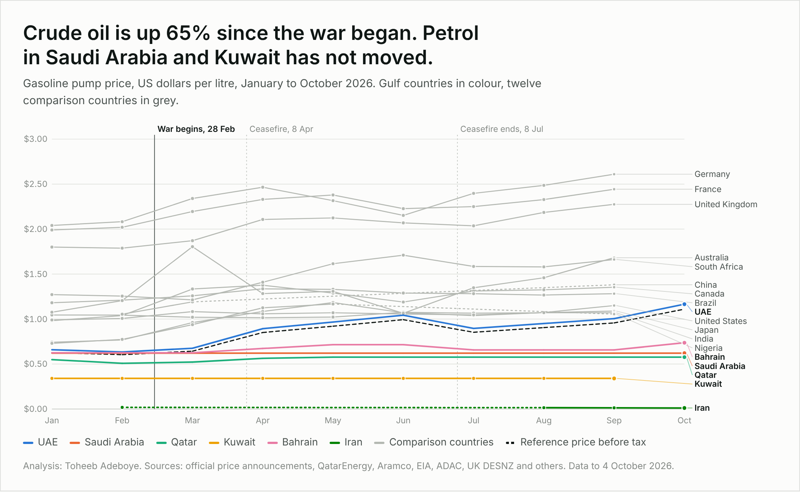

# Gulf Fuel Subsidy Tracker

**Who is paying for cheap fuel in the Gulf since the 2026 Iran war began?**

**[Open the interactive dashboard](https://dtsquarea12.github.io/DATA-ANALYST-PROJECT/gulf-fuel-subsidy-tracker/)**



## The question

Crude oil rose 65% after the US-Iran war began on 28 February 2026, yet petrol at filling stations in most Gulf countries barely moved. This project measures the gap between what drivers pay and what the fuel is worth on the open market, and estimates what that gap costs each government.

## Key findings (gasoline, 95 octane)

| | Pre-war (Jan to Feb) | Latest | Change |
|---|---|---|---|
| Brent crude, per barrel | $70.89 (Feb) | $116.80 (Sep) | +65% |
| Saudi Arabia, per litre | SAR 2.33 | SAR 2.33 | 0% |
| Kuwait, per litre | 105 fils | 105 fils | 0% |
| Qatar, per litre | QAR 1.93 | QAR 2.10 | +9% |
| Bahrain, per litre | 235 fils | 277 fils | +18% |
| UAE, per litre | AED 2.38 | AED 4.28 | +80% |

- The UAE passes the world price on every month. At $1.17 a litre in October, UAE drivers pay about what US drivers do ($1.15 in September).
- For the five GCC states, the estimated gasoline subsidy rose from a rate of about $4bn a year at pre-war prices to about $16bn a year since March. Saudi Arabia accounts for about $12bn.
- No government announced a new subsidy. The world price rose and the capped pump prices stayed where they were.
- Iran sells petrol for one to four US cents a litre at the open-market exchange rate. The gap implies roughly $44bn a year on gasoline, the least certain estimate here.
- Germany pays almost eight times what Kuwait pays for the same litre.

## Scope

- **Gulf:** UAE, Saudi Arabia, Qatar, Kuwait, Bahrain, Iran
- **Comparison:** United States, Canada, United Kingdom, Germany, France, India, China, Japan, Nigeria, South Africa, Brazil, Australia
- **Fuels:** gasoline and diesel, in US dollars per litre
- **Period:** January to October 2026. Pre-war is the January to February average; the war began on 28 February.

## Method

Price-gap approach, as used by the IEA and IMF:

```
gap per litre  = reference price x (1 + VAT) - pump price
annual subsidy = gap per litre x litres sold per year
```

Two reference prices are available as a filter on the dashboard:

- **Regional market:** the UAE pump price before VAT. The UAE deregulated fuel prices in 2015, and its price tracked Singapore spot gasoline plus distribution costs within a few cents from May to August 2026.
- **International spot:** EIA US Gulf Coast spot price plus $0.185 a litre for distribution (midpoint of the IMF range of $0.15 to $0.22). This gives higher estimates.

Local prices are converted at the currency peg (AED 3.6725, SAR 3.75, QAR 3.64, BHD 0.376, KWD 0.3085 per USD). Comparison countries use monthly average exchange rates.

## Tools

- **Python** for data preparation and the subsidy calculations (`build_data.py`)
- **HTML, JavaScript and SVG** for the dashboard, with no chart library
- **CSV** outputs shaped for Power BI or Tableau

## Repository structure

| File | Contents |
|---|---|
| `index.html` | Interactive dashboard with filters for fuel, period, reference price, unit, region and country |
| `build_data.py` | Builds the dataset and runs the calculations |
| `data/fuel_prices_tidy.csv` | One row per country, month and fuel, in USD per litre |
| `data/benchmarks.csv` | Monthly Brent and US Gulf Coast spot prices |
| `data/subsidy_estimates.csv` | Per-litre gaps and annualised subsidy by country and fuel |
| `data/gulf_prices_local_currency.csv` | Official Gulf prices in local currency, every grade, with source links |
| `data/comparison_prices_sources.csv` | Comparison-country prices with exchange rates and source links |

## Limitations

- Annual totals use 2023 sales volumes (OAPEC) and one grade per country. Read them as orders of magnitude.
- Diesel totals apply the pump price to all gasoil use, including industry, so they overstate.
- Iran uses the middle quota tier (30,000 rials a litre) at the open-market rate, only for months with a dated rate quote. Volumes include smuggled fuel.
- China, Australia and Canada are single-day readings, not monthly averages. Nigeria has no national average after May. Kuwait's fourth-quarter price was not published as of 4 October 2026.
- Grades differ: 95 octane in the Gulf and Europe, regular in North America.
- Bahrain fuel is treated as zero-rated for VAT.

## Sources

Gulf News, Emirates 24|7, Aramco, QatarEnergy, The Peninsula, Arab Times, Al Rai, Gulf Daily News, Iran International, MEES, Trend, US EIA, UK DESNZ, ADAC, prix-carburant.eu, Kalibrate, ANP via INEEP, METI, NBS Nigeria, Fuels Industry Association of South Africa, ACCC, World Bank Pink Sheet, IEA, IMF WP/23/169, OAPEC Annual Statistical Report 2024. Row-level links are in the data files.

## Author

Toheeb Adeboye, Data Analyst

Independent analysis of public data. Estimates, not official statistics.
