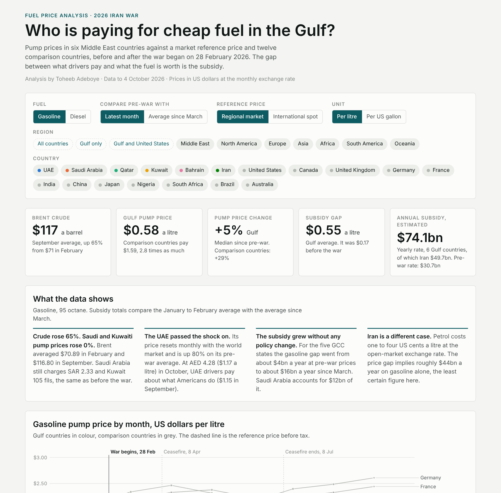
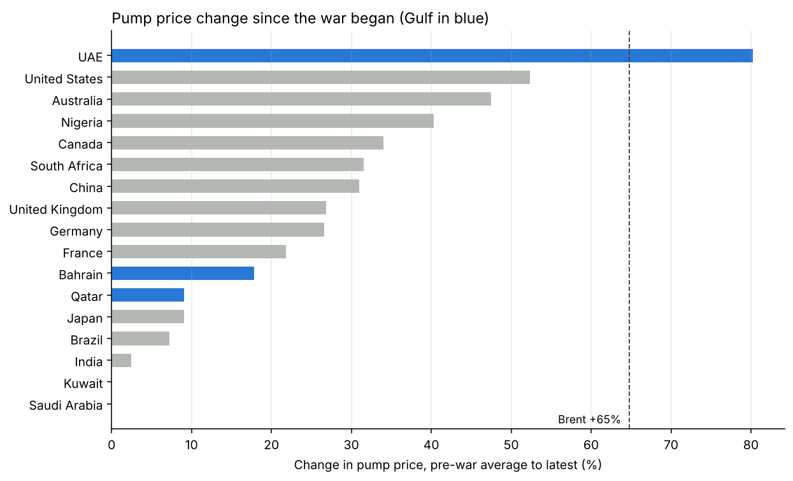
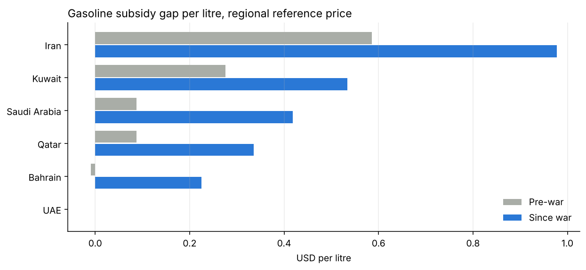

# Gulf Fuel Subsidy Tracker

**Who is paying for cheap fuel in the Gulf since the 2026 Iran war began?**

**[Open the interactive dashboard](https://dtsquarea12.github.io/DATA-ANALYST-PROJECT/gulf-fuel-subsidy-tracker/)** · [Analysis notebook](notebooks/fuel_subsidy_analysis.ipynb) · [SQL queries](sql/analysis_queries.sql) · [Data dictionary](docs/data_dictionary.md)


## Contents

1. [Project background](#project-background)
2. [Questions](#questions)
3. [Executive summary](#executive-summary)
4. [Insights](#insights)
5. [Recommendations](#recommendations)
6. [Data](#data)
7. [Method](#method)
8. [Tools](#tools)
9. [Repository structure](#repository-structure)
10. [How to reproduce](#how-to-reproduce)
11. [Assumptions and limitations](#assumptions-and-limitations)
12. [Sources](#sources)
13. [Author](#author)

## Project background

The US-Iran war began on 28 February 2026 and the Strait of Hormuz closed within days. Brent crude rose from an average of $70.89 a barrel in February to $116.80 in September. Pump prices jumped across Europe, North America, Africa and Asia. In most Gulf states they barely moved.

A pump price that does not follow the market has to be paid for by someone. This project measures the gap between what Gulf drivers pay and what the fuel is worth, and estimates what that gap costs each government, before and after the war began.

## Questions

1. How much did filling-station prices change in six Gulf countries after the war began?
2. How do those prices compare with countries on every other continent?
3. How large is the subsidy per litre, and how did the war change it?
4. What does the subsidy add up to over a year?

## Executive summary

Crude oil rose 65%. Saudi Arabia and Kuwait did not raise the pump price at all, and Qatar and Bahrain raised it by 9% and 18%. The UAE, which resets its price every month with the world market, raised it by 80% and now charges about what US drivers pay.

For the five GCC states, the estimated gasoline subsidy rose from a rate of about **$4bn a year** at pre-war prices to about **$16bn a year** since March. No government announced a new subsidy. The world price rose and the capped pump prices stayed where they were.

| Gasoline, 95 octane | Pre-war (Jan to Feb) | Latest | Change |
|---|---|---|---|
| Brent crude, per barrel | $70.89 (Feb) | $116.80 (Sep) | +65% |
| Saudi Arabia, per litre | SAR 2.33 | SAR 2.33 | 0% |
| Kuwait, per litre | 105 fils | 105 fils | 0% |
| Qatar, per litre | QAR 1.93 | QAR 2.10 | +9% |
| Bahrain, per litre | 235 fils | 277 fils | +18% |
| UAE, per litre | AED 2.38 | AED 4.28 | +80% |



## Insights

### 1. The oil shock reached drivers almost everywhere except the Gulf

Pump prices rose 52% in the United States, 47% in Australia, 40% in Nigeria and about 27% in Germany and the United Kingdom. Among the Gulf states only the UAE moved with the market.



### 2. The UAE is no longer a cheap-fuel country

At AED 4.28 a litre in October ($1.17), the UAE price is level with the United States ($1.15 in September) and above India, Japan and Nigeria. The UAE deregulated fuel prices in 2015, which is why it serves as the regional reference price in this analysis.

### 3. The subsidy grew without a policy change

The gap between the market price and the pump price widened in every capped market as the world price rose.

| Gasoline subsidy gap, USD per litre | Pre-war | Since war |
|---|---|---|
| Kuwait | 0.28 | 0.53 |
| Saudi Arabia | 0.09 | 0.42 |
| Qatar | 0.09 | 0.34 |
| Bahrain | 0.00 | 0.23 |
| UAE | 0.00 | 0.00 |



### 4. Saudi Arabia carries most of the cost

| Estimated gasoline subsidy, USD bn a year | Pre-war rate | Since-war rate |
|---|---|---|
| Saudi Arabia | 2.6 | 12.4 |
| Kuwait | 1.4 | 2.7 |
| Qatar | 0.2 | 1.0 |
| Bahrain | 0.0 | 0.3 |
| UAE | 0.0 | 0.0 |
| **GCC five** | **4.2** | **16.4** |

On the alternative international reference price the since-war total is about $25bn a year. Either way Saudi Arabia accounts for 70 to 75% of it.

### 5. Iran is a separate case

Petrol in Iran costs one to four US cents a litre at the open-market exchange rate, across three quota tiers. The price gap implies roughly $44bn a year on gasoline. This is the least certain figure in the project and is reported separately from the GCC total.

### 6. The spread between countries is very wide

A litre of petrol costs almost eight times as much in Germany ($2.61) as in Kuwait ($0.34). More than half of the German price is tax.

## Recommendations

These follow from the data and are aimed at people who plan around fuel costs. They are not policy advice.

- **Fiscal and budget analysts:** treat capped pump prices as a cost that moves with the oil price. For Saudi Arabia, the gasoline gap alone went from about $2.6bn to about $12.4bn a year without any decision being taken. Budget scenarios should carry this as a line that scales with crude.
- **Businesses with fleets in the Gulf:** fuel cost exposure now differs sharply by country. Operations in the UAE have absorbed an 80% rise, while those in Saudi Arabia, Kuwait and Qatar have seen almost none. Bahrain moved to monthly pricing in December 2025 and has risen three times since the war began, so it is the capped market most likely to move again.
- **Anyone comparing fuel prices across countries:** compare against a market reference price, not against crude. Tax explains most of the gap between Europe and North America, and subsidy explains most of the gap between the Gulf and everyone else.
- **Next steps for this analysis:** replace 2023 sales volumes with 2026 figures when published, add the official Singapore spot series as a third reference price, and update monthly as new prices are announced.

## Data

291 monthly price readings for 18 countries, January to October 2026, plus benchmark prices. All figures come from public sources.

| File | Rows | Contents |
|---|---|---|
| `data/processed/fuel_prices_tidy.csv` | 291 | One row per country, month and fuel, in USD per litre. The main analysis table |
| `data/processed/benchmarks.csv` | 10 | Monthly Brent and US Gulf Coast spot prices |
| `data/processed/subsidy_estimates.csv` | 11 | Per-litre gaps and annualised subsidy by country and fuel |
| `data/raw/gulf_prices_local_currency.csv` | 242 | Official Gulf prices in local currency, every grade, with source link and confidence flag |
| `data/raw/comparison_prices_sources.csv` | 232 | Comparison-country prices with exchange rate and source link |

Column definitions are in the [data dictionary](docs/data_dictionary.md).

**Countries.** Gulf: UAE, Saudi Arabia, Qatar, Kuwait, Bahrain, Iran. Comparison: United States, Canada, United Kingdom, Germany, France, India, China, Japan, Nigeria, South Africa, Brazil, Australia.

**Data checks.** No missing values and no duplicate country-month-fuel rows in the analysis table. Each Gulf price was checked against a second source where one existed; the confidence flag in the raw file records which were. Coverage by country is reported in the notebook before any averages are taken.

## Method

Price-gap approach, as used by the IEA and IMF:

```
gap per litre  = reference price x (1 + VAT) - pump price
annual subsidy = gap per litre x litres sold per year
```

- **Pre-war** is the average of January and February 2026. **Since war** is March 2026 onward.
- **Regional reference price:** the UAE pump price before VAT. It tracked Singapore spot gasoline plus distribution costs within a few cents from May to August 2026. By construction the UAE gap is zero.
- **International reference price:** EIA US Gulf Coast spot price plus $0.185 a litre for distribution, the midpoint of the IMF range of $0.15 to $0.22. Used as a sensitivity check.
- **Currency.** Gulf prices are converted at the currency peg (AED 3.6725, SAR 3.75, QAR 3.64, BHD 0.376, KWD 0.3085 per USD). Comparison countries use monthly average exchange rates.
- **Volumes.** 2023 gasoline and gasoil sales from the OAPEC Annual Statistical Report 2024; Iran from its national distribution company.

## Tools

| Tool | Used for |
|---|---|
| Python (pandas, matplotlib) | Data preparation, subsidy calculations, notebook analysis and charts |
| SQL (SQLite) | Aggregation and ranking queries on the tidy table |
| JavaScript, HTML, SVG | Interactive dashboard with filters, built without a chart library |
| Git and GitHub Pages | Version control and hosting |

The tidy CSV is shaped to load directly into Power BI or Tableau.

## Repository structure

```
gulf-fuel-subsidy-tracker/
├── index.html                  Interactive dashboard
├── README.md
├── requirements.txt
├── data/
│   ├── raw/                    Collected prices with source links
│   └── processed/              Analysis-ready tables
├── notebooks/
│   └── fuel_subsidy_analysis.ipynb
├── scripts/
│   └── build_data.py           Builds processed data and estimates
├── sql/
│   └── analysis_queries.sql
├── images/                     Charts and dashboard preview
└── docs/
    └── data_dictionary.md
```

## How to reproduce

```bash
git clone https://github.com/dtsquarea12/DATA-ANALYST-PROJECT.git
cd DATA-ANALYST-PROJECT/gulf-fuel-subsidy-tracker
pip install -r requirements.txt
python scripts/build_data.py
jupyter notebook notebooks/fuel_subsidy_analysis.ipynb
```

Open `index.html` in a browser to use the dashboard locally. The notebook checks its results against the build script's output, so the two cannot drift apart.

## Assumptions and limitations

- Annual totals use 2023 sales volumes and one grade per country. Read them as orders of magnitude.
- The annual figures are yearly rates at each period's prices, not money already spent.
- Diesel totals apply the pump price to all gasoil use, including industry, so they overstate.
- Iran uses the middle quota tier (30,000 rials a litre) at the open-market rate, only for months with a dated rate quote. Its volumes include smuggled fuel.
- China, Australia and Canada are single-day readings, not monthly averages. Nigeria has no national average after May. Kuwait's fourth-quarter price was not published as of 4 October 2026.
- Grades differ: 95 octane in the Gulf and Europe, regular in North America.
- Bahrain fuel is treated as zero-rated for VAT.
- Data was collected up to 4 October 2026. The war is ongoing and prices change monthly.

## Sources

**Gulf prices:** Gulf News, Emirates 24|7, Aramco, QatarEnergy, The Peninsula, Arab Times, Al Rai, Gulf Daily News, Iran International, MEES, Trend.
**Comparison prices:** US EIA, UK DESNZ, ADAC, prix-carburant.eu, Kalibrate, ANP via INEEP, METI, NBS Nigeria, Fuels Industry Association of South Africa, ACCC.
**Benchmarks and method:** US EIA, World Bank Pink Sheet, IEA, IMF WP/23/169, OAPEC Annual Statistical Report 2024.

Row-level source links are in the files under `data/raw/`.

## Author

**Toheeb Adeboye**, Data Analyst, Doha, Qatar
[LinkedIn](https://www.linkedin.com/in/dtsquarea/) · [GitHub](https://github.com/dtsquarea12)

Independent analysis of public data. Estimates, not official statistics.
