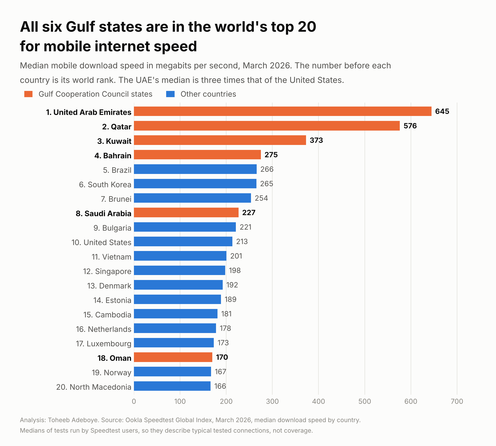
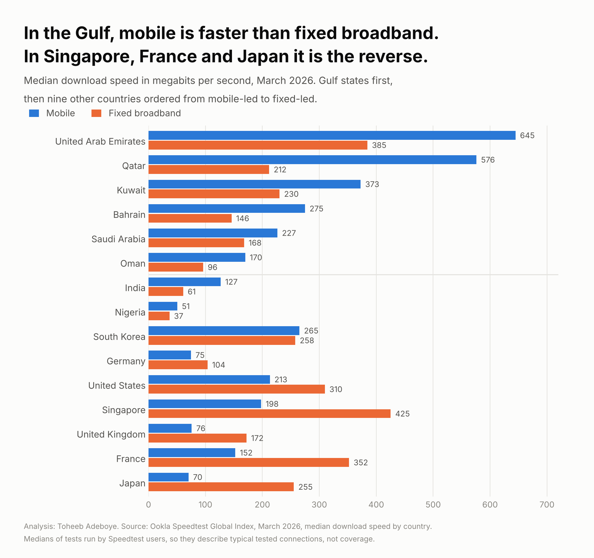

# Mobile Internet Speed by Country

**Where in the world is mobile internet fastest, and how does it compare with fixed broadband in the same country?**

[Notebook](notebooks/mobile_internet_speed_analysis.ipynb) · [SQL](sql/analysis_queries.sql) · [Data dictionary](docs/data_dictionary.md) · [Country table](data/processed/speed_by_country.csv)



## Contents

1. [Project background](#project-background)
2. [Questions](#questions)
3. [Executive summary](#executive-summary)
4. [Insights](#insights)
5. [Recommendations](#recommendations)
6. [Data](#data)
7. [Method](#method)
8. [Tools](#tools)
9. [Repository structure](#repository-structure)
10. [How to reproduce](#how-to-reproduce)
11. [Assumptions and limitations](#assumptions-and-limitations)
12. [Sources](#sources)
13. [Author](#author)

## Project background

Connection speed shapes everyday business decisions: where a remote team can work from, whether a product can assume video and large downloads on a phone, and whether an office or a traveller needs a fixed line at all. Ookla's Speedtest Global Index publishes the median download speed for mobile networks and for fixed broadband in each country every month, based on tests run by users of the Speedtest app.

This project takes the March 2026 index for 75 countries, covering the full world top 40 for mobile and a selection from every region, and compares the two networks country by country. Results for the Middle East are shown first, then the other regions.

## Questions

1. Which countries have the fastest mobile internet, and where do the Gulf states stand?
2. How large is the gap between the fastest countries and other major markets?
3. In which countries is mobile faster than fixed broadband, and in which is it the reverse?

## Executive summary

All six Gulf Cooperation Council states are in the world top 20 for median mobile download speed, and four of them hold the first four places. The United Arab Emirates leads at 644.66 Mbps, followed by Qatar at 576.06 Mbps. The UAE median is three times that of the United States and more than eight times that of Germany or the United Kingdom. In every Gulf state the mobile network is faster than fixed broadband. In Singapore, France, the United Kingdom and Japan it is the reverse, with fixed broadband more than twice as fast as mobile.

| Measure | Value | Checked in |
|---|---|---|
| UAE median mobile download speed, world rank 1 | 644.66 Mbps | Two sources |
| Qatar median mobile download speed, world rank 2 | 576.06 Mbps | Two sources |
| Gulf states in the world top 20 for mobile | 6 of 6 (ranks 1, 2, 3, 4, 8, 18) | One source, rank order tested |
| UAE mobile median compared with the United States | 3.0 times (644.66 against 213.29 Mbps) | Derived |
| Gulf states where mobile is faster than fixed broadband | 6 of 6 | Derived |
| Singapore median fixed broadband speed, highest collected | 425.46 Mbps | Two sources |



## Insights

### 1. The Gulf holds the first four places for mobile speed

| World rank | Country | Median mobile download, Mbps |
|---|---|---|
| 1 | United Arab Emirates | 644.66 |
| 2 | Qatar | 576.06 |
| 3 | Kuwait | 372.76 |
| 4 | Bahrain | 274.94 |
| 8 | Saudi Arabia | 226.53 |
| 18 | Oman | 169.87 |

The rest of the top 20 is spread across regions: seven European countries, five in Asia-Pacific (South Korea, Brunei, Vietnam, Singapore, Cambodia) and two in the Americas (Brazil and the United States).

### 2. The gap to other large markets is wide

| Country | Median mobile download, Mbps | UAE median as a multiple |
|---|---|---|
| United Arab Emirates | 644.66 | 1.0 |
| United States | 213.29 | 3.0 |
| India | 126.73 | 5.1 |
| United Kingdom | 75.91 | 8.5 |
| Germany | 74.58 | 8.6 |
| Japan | 70.28 | 9.2 |
| Nigeria | 50.53 | 12.8 |

A median of 50 Mbps is still enough for video calls and streaming. The difference matters most for heavy use: large file transfers, many devices sharing one connection, and products that assume a fast phone connection.

### 3. Countries split into mobile-led and fixed-led

Mobile is faster than fixed broadband in 33 of the 75 countries collected, and in all six Gulf states. In Qatar the mobile median is 2.7 times the fixed median.

| Country | Mobile, Mbps | Fixed, Mbps | Mobile divided by fixed |
|---|---|---|---|
| Qatar | 576.06 | 211.97 | 2.72 |
| India | 126.73 | 60.85 | 2.08 |
| Bahrain | 274.94 | 145.88 | 1.88 |
| United Arab Emirates | 644.66 | 384.51 | 1.68 |
| Nigeria | 50.53 | 36.81 | 1.37 |
| South Korea | 265.20 | 257.76 | 1.03 |
| United States | 213.29 | 309.80 | 0.69 |
| Singapore | 197.89 | 425.46 | 0.47 |
| United Kingdom | 75.91 | 172.24 | 0.44 |
| France | 152.50 | 352.35 | 0.43 |
| Japan | 70.28 | 255.27 | 0.28 |

Japan and the United Kingdom sit outside the mobile top 40 but have fast fixed lines. A country's place in one ranking says little about its place in the other.

### 4. Middle East and North Africa first, then the other regions

Within the Middle East and North Africa, 14 of the 17 countries collected are mobile-led. Outside the Gulf, Turkey has the fastest mobile median (110.40 Mbps), and Israel (281.29 Mbps) and Jordan (194.10 Mbps) have fast fixed broadband.

By region, among the countries collected: mobile is faster in 9 of 29 European countries, 6 of 18 in Asia-Pacific, 1 of 8 in the Americas and all 3 in Sub-Saharan Africa. The full country list is in [`speed_by_country.csv`](data/processed/speed_by_country.csv).

## Recommendations

**For companies building mobile products for Gulf markets:** median phone connections in the UAE and Qatar are faster than typical fixed lines in most countries. Video, high-resolution media and large downloads can be designed for mobile first in these markets.

**For companies serving several regions with one product:** design for the slower median. A feature that works at 645 Mbps in the UAE will meet connections of around 50 to 75 Mbps in Nigeria, Germany and the United Kingdom. Test at those speeds before launch.

**For remote workers and people relocating:** check both networks for the destination country. In the Gulf a 5G phone plan or mobile router can do the job of a fixed line. In Japan, France, Spain or Chile, a fixed line is the stronger option.

**For teams choosing office or site connectivity:** in mobile-led countries a mobile connection is a realistic backup link or a primary link for small sites. In fixed-led countries it is a backup only.

## Data

| File | Rows | Contents |
|---|---|---|
| `data/raw/speedtest_readings_march_2026.csv` | 157 | Every figure collected for March 2026, one row per country, network and source, with link |
| `data/raw/speedtest_other_months.csv` | 15 | Readings for December 2023, October 2025 and September 2026, for context |
| `data/processed/speed_by_country.csv` | 75 | One row per country: mobile, fixed, ratio, faster network |
| `data/processed/speed_tidy.csv` | 150 | Long format, one row per country and network |
| `data/processed/group_summary.csv` | 7 | Medians for the GCC states, each region and all countries collected |

Coverage: 75 countries. Middle East and North Africa 17, Europe 29, Asia-Pacific 18, Americas 8, Sub-Saharan Africa 3. The sample is the complete world top 40 for mobile plus 35 other countries chosen to cover every region and the largest economies.

Checks done by `scripts/build_data.py`, which stops with an error if any fails:

- No missing values, no duplicate reading from one source, one index month only, every speed between 1 and 1,000 Mbps.
- Every figure that appears in two sources is the same in both. Seven figures are confirmed this way and none disagree.
- The published ranks 1 to 40 follow the order of the speeds exactly, and no unranked country is faster than rank 40. A misread speed in the top 40 would break this.

## Method

The speeds are the published medians. Nothing is estimated or interpolated. Two measures are derived:

```
mobile_to_fixed_ratio = median mobile download speed / median fixed broadband download speed
uae_mobile_multiple   = UAE median mobile download speed / country median mobile download speed

Example, Qatar:          576.06 / 211.97 = 2.72
Example, United States:  644.66 / 213.29 = 3.0
```

A median is the middle value: half of the tests in a country were faster and half were slower. It describes a typical tested connection better than an average, which a small number of very fast tests can pull up.

## Tools

- Python (pandas) for the build script and checks
- matplotlib for the charts
- SQL (SQLite) for the queries in `sql/analysis_queries.sql`
- Jupyter notebook for the walk-through

## Repository structure

```
mobile-internet-speed-by-country/
  README.md
  requirements.txt
  data/raw/speedtest_readings_march_2026.csv
  data/raw/speedtest_other_months.csv
  data/processed/speed_by_country.csv
  data/processed/speed_tidy.csv
  data/processed/group_summary.csv
  notebooks/mobile_internet_speed_analysis.ipynb
  scripts/build_data.py
  scripts/make_charts.py
  sql/analysis_queries.sql
  images/
  docs/data_dictionary.md
```

## How to reproduce

```
pip install -r requirements.txt
python scripts/build_data.py     # checks the raw readings and writes data/processed
python scripts/make_charts.py    # writes the charts to images/
jupyter notebook notebooks/mobile_internet_speed_analysis.ipynb
```

To run the SQL, load `speed_by_country.csv` as table `speed` and `speed_tidy.csv` as table `tidy` in SQLite.

## Assumptions and limitations

- **The figures were read from a published transcription of the index, not from Ookla's own site,** which could not be opened when the data was collected. Seven figures, including the UAE, Qatar and Kuwait mobile medians, were confirmed in a second source. The other 143 rest on one source. The rank-order check guards the top 40 against misreadings but does not confirm the figures independently.
- **March 2026 is not the newest month.** It is the newest month for which a full country table with both networks could be collected. A September 2026 reading found for the UAE (675.51 Mbps) and Qatar (535.94 Mbps) from a single source shows the same two countries in first and second place.
- **Speedtest results come from people who choose to run a test.** They tend to have newer phones and better plans than the average user, and they test more often in cities. The medians describe tested connections, not coverage or the experience of every user.
- **Download speed is one part of connection quality.** Upload speed, latency, reliability, coverage outside cities and price are not in this analysis.
- **The 75 countries are a sample.** The regional counts and medians describe the countries collected, not whole regions. Sub-Saharan Africa has only three countries here.
- **Small countries rank well.** Compact, urban countries are easier to cover with dense 5G networks, which is part of why city-states and small states appear near the top.
- **One month.** Ranks move from month to month, especially in the middle of the table.

## Sources

- Ookla, Speedtest Global Index, March 2026, as transcribed in [List of countries by Internet connection speeds](https://en.wikipedia.org/wiki/List_of_countries_by_Internet_connection_speeds)
- [VoxBooster, Internet Speed Statistics 2026](https://voxbooster.com/blog/internet-speed-statistics-2026/), second source for seven March 2026 figures
- Other months: [Statista](https://www.statista.com/statistics/896768/countries-fastest-average-mobile-internet-speeds/) (September 2026), [Earthsims](https://www.earthsims.com/data/country-connectivity-speeds/) and [Cellesim](https://cellesim.com/en/mobile-internet-speeds-by-country-2026) (October 2025), [Databoks](https://databoks.katadata.co.id/en/technology-telecommunications/statistics/4fa89c996df47e2/top-10-countries-with-the-fastest-median-internet-speeds-in-the-world-arab-nations-lead) (December 2023)

## Author

**Toheeb Adeboye**, Data Analyst, Doha, Qatar. [LinkedIn](https://www.linkedin.com/in/dtsquarea/)
