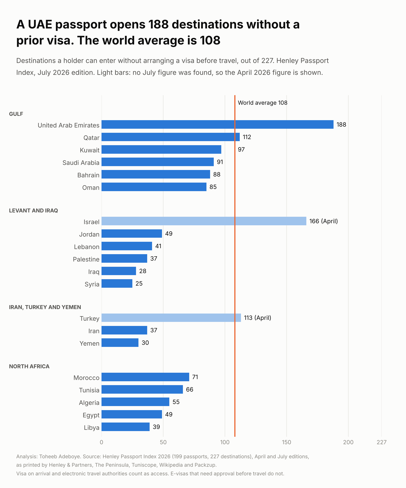
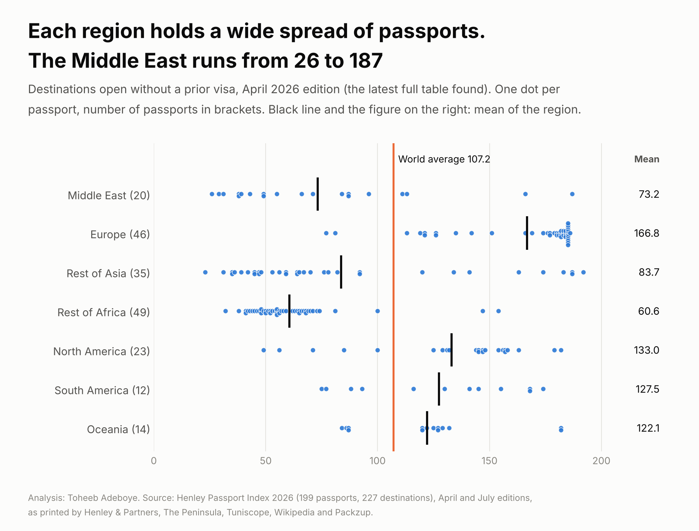
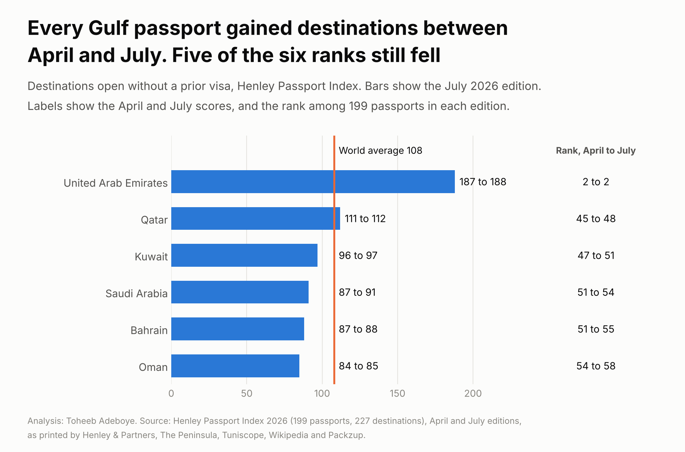

# Passport Strength by Country

**How many destinations can the holder of each Middle East passport enter without arranging a visa before travel, and how does the region compare with the rest of the world?**

[Notebook](notebooks/passport_strength_analysis.ipynb) · [SQL queries](sql/analysis_queries.sql) · [Data dictionary](docs/data_dictionary.md) · [Tidy data](data/processed/passport_tidy.csv)



## Contents

1. [Project background](#project-background)
2. [Questions](#questions)
3. [Executive summary](#executive-summary)
4. [Insights](#insights)
5. [Recommendations](#recommendations)
6. [Data](#data)
7. [Method](#method)
8. [Tools](#tools)
9. [Repository structure](#repository-structure)
10. [How to reproduce](#how-to-reproduce)
11. [Assumptions and limitations](#assumptions-and-limitations)
12. [Sources](#sources)
13. [Author](#author)

## Project background

A company that sends staff abroad, and a person planning a trip, both face the same first question: does this passport need a visa arranged before travel? The Henley Passport Index answers it with one number per passport. It scores 199 passports against 227 destinations using data from the International Air Transport Association, and it is updated through the year. This project takes the 2026 editions, puts the 20 Middle East passports first, and sets them against every other region. The full table is from the April 2026 edition. The July 2026 edition is added for every passport where a document printing the figure could be found.

## Questions

1. How many destinations does each Middle East passport open without a prior visa?
2. How do the six Gulf passports compare with each other and with the world average?
3. What changed for the Gulf between the April and July 2026 editions?
4. How does the Middle East compare with Europe, Asia, Africa, the Americas and Oceania?
5. How far can each figure be confirmed in a second document?

## Executive summary

In the July 2026 edition a United Arab Emirates passport opens 188 of 227 destinations without a prior visa. It shares second place of 199 passports with Japan and South Korea, behind Singapore on 192. The other five Gulf passports open between 85 and 112 destinations. The world average is 108, so two of the six Gulf passports sit above it. Across the 20 Middle East passports the latest figures run from 188 to 25, and four are above the world average.

| Measure | Value |
|---|---|
| Passports scored, destinations counted | 199, 227 |
| World average score, July 2026 (published) | 108 |
| World mean score, April 2026 table (computed) | 107.21 |
| UAE, July 2026 | 188, joint 2nd |
| Qatar, Kuwait, Saudi Arabia, Bahrain, Oman, July 2026 | 112, 97, 91, 88, 85 |
| Gulf passports above the world average | 2 of 6 |
| Middle East mean score, April 2026 (20 passports) | 73.25 |
| Middle East passports above the world mean | 4 of 20 |
| Highest and lowest latest score in the Middle East | 188 (UAE), 25 (Syria) |
| April scores printed identically by two publishers | 198 of 199 |



## Insights

### 1. The UAE passport is joint second in the world, and the Gulf spans 85 to 188

| Gulf passport | Score, July 2026 | Rank of 199, July 2026 |
|---|---|---|
| United Arab Emirates | 188 | 2 |
| Qatar | 112 | 48 |
| Kuwait | 97 | 51 |
| Saudi Arabia | 91 | 54 |
| Bahrain | 88 | 55 |
| Oman | 85 | 58 |

The six passports are 103 destinations apart from top to bottom. The UAE and Qatar are above the published world average of 108. Henley & Partners reports that the UAE was ranked 62nd when the index began in 2006 and has added 153 destinations since.

### 2. Every Gulf score rose between April and July, and five of the six ranks fell



Saudi Arabia gained four destinations (87 to 91). The other five gained one each. Ranks moved the other way for every Gulf passport except the UAE: Qatar went from 45th to 48th while its score went from 111 to 112. A rank depends on what every other passport did in the same period, so the score is the better number to track over time.

### 3. A rank understates how many passports sit ahead

The index gives tied passports the same rank and does not skip ranks afterwards. The 199 passports in the April table hold only 101 distinct ranks. Qatar was 45th in April, and 94 passports had a higher score. Kuwait was 47th with 97 ahead of it.

| Passport | Rank, April 2026 | Passports with a higher score |
|---|---|---|
| United Arab Emirates | 2 | 1 |
| Israel | 16 | 47 |
| Turkey | 44 | 92 |
| Qatar | 45 | 94 |
| Kuwait | 47 | 97 |
| Bahrain, Saudi Arabia | 51 | 102 |
| Oman | 54 | 108 |

### 4. Four of the 20 Middle East passports are above the world average

On the April table the Middle East mean is 73.25 against a world mean of 107.21. The UAE (187), Israel (166), Turkey (113) and Qatar (111) are above the world mean. Using the latest figure for each passport gives a mean of 73.35 and the same four passports above 108.

| Sub-region | Passports | Mean score, April 2026 | Lowest | Highest |
|---|---|---|---|---|
| Gulf | 6 | 108.67 | 84 | 187 |
| Iran, Turkey and Yemen | 3 | 60.67 | 31 | 113 |
| Levant and Iraq | 6 | 58.5 | 26 | 166 |
| North Africa | 5 | 56 | 39 | 71 |

### 5. Regions differ by more than 100 destinations on average

| Region | Passports | Mean score, April 2026 | Lowest | Highest | Above world mean |
|---|---|---|---|---|---|
| Middle East | 20 | 73.25 | 26 | 187 | 4 |
| Europe | 46 | 166.76 | 77 | 186 | 44 |
| North America | 23 | 133.04 | 49 | 182 | 18 |
| South America | 12 | 127.5 | 75 | 174 | 8 |
| Oceania | 14 | 122.14 | 84 | 182 | 10 |
| Rest of Asia | 35 | 83.74 | 23 | 192 | 9 |
| Rest of Africa | 49 | 60.57 | 32 | 154 | 2 |
| World | 199 | 107.21 | 23 | 192 | 95 |

The world median is 92, below the mean of 107.21, because 38 passports are bunched between 179 and 192.

## Recommendations

For employers and mobility teams with staff of mixed nationalities:

- Plan business travel by passport, not by office. Two colleagues based in the same Gulf city can differ by more than 100 destinations in where they can go at short notice. Build visa lead time into project plans for the passports at the lower end of the table.
- Track the score, not the rank. Between April and July 2026 every Gulf score rose while five ranks fell.

For individuals planning travel or relocation:

- Use the score as a first filter only. It counts destinations and does not weigh them. Check the entry rules of the specific destination before booking, because rules change between editions (Lebanon's score moved by two between April and July).

For analysts using the index:

- Read a rank together with the number of passports ahead. Tied ranks compress the table: rank 45 in April had 94 passports above it.

## Data

| File | Rows | Content |
|---|---|---|
| `data/raw/henley_2026_april_reading_wikipedia.csv` | 199 | April 2026 table as printed on Wikipedia |
| `data/raw/henley_2026_april_reading_packzup.txt` | 101 lines, 199 passports | April 2026 table as printed by Packzup |
| `data/raw/henley_2026_edition_readings.csv` | 108 | April and July figures printed in individual documents, one row per figure per document |
| `data/raw/published_figures.csv` | 9 | Published totals and averages used as checks |
| `data/raw/country_reference.csv` | 199 | Country code and region for each passport |
| `data/raw/sources.csv` | 12 | Every document used, with link and date |
| `data/processed/passport_tidy.csv` | 199 | One row per passport: April score and rank, July score and rank where found, check status |
| `data/processed/middle_east_editions.csv` | 40 | The 20 Middle East passports in long form, two editions |
| `data/processed/region_summary.csv` | 12 | Seven regions, four Middle East sub-regions and the world |
| `data/processed/source_checks.csv` | 4 | Published totals against computed totals |

Coverage: 199 passports in seven regions. Middle East 20 (Gulf 6, Levant and Iraq 6, North Africa 5, Iran, Turkey and Yemen 3), Europe 46, Rest of Asia 35, Rest of Africa 49, North America 23, South America 12, Oceania 14.

Checks done:

- Row count 199 in both readings of the April table, no missing values, no duplicate passports, scores between 23 and 192.
- The two readings agree on score and rank for 198 of 199 passports. Bangladesh differs (34 on Wikipedia, 36 on Packzup). A third article prints 36, and 36 fits the rank order, so 36 is used and the row is marked `publishers-differ`. The choice moves the world mean from 107.21 to 107.2.
- The printed rank equals the dense rank of the score for all 199 passports.
- 41 April scores and 45 April ranks printed in three news articles all equal the table.
- The gap between the highest and lowest score equals the published figure in both editions (169 in April, 170 in July). The April mean of 107.21 is within one destination of the published July average of 108.
- A July score is accepted only when every document printing it gives the same number. No April to July change exceeds four destinations.
- July figures in the Middle East: UAE in five publishers, the other five Gulf passports in three, four passports in two, eight in one, and none found for Israel and Turkey.

## Method

Descriptive comparison of a published index: simple means, medians and counts by region, and the change between two editions.

```
score                 = destinations (of 227) open without a visa arranged before travel
rank                  = dense rank of the score, highest first (ties share a rank, no ranks skipped)
mean score of a group = sum of score_apr_2026 in the group / number of passports in the group
change_apr_to_jul     = score_jul_2026 - score_apr_2026
latest_score          = score_jul_2026 if a July figure was found, otherwise score_apr_2026
apr_check             = two-publishers     if both readings print the same score and rank
                        publishers-differ  otherwise
jul_check             = number of publishers printing the same July score
```

Region means use the April edition because it is the latest one for which a full table of 199 passports could be read. The result was run both ways for the Middle East: on April figures (mean 73.25) and on the latest figure for each passport (mean 73.35).

## Tools

Python (pandas, matplotlib), SQL (SQLite).

## Repository structure

```
passport-strength-by-country/
  README.md
  requirements.txt
  data/raw/                  two readings of the April table, July readings, published figures, sources
  data/processed/            tidy table, Middle East by edition, region summary, source checks
  notebooks/                 passport_strength_analysis.ipynb, executed
  scripts/                   build_data.py, make_charts.py
  sql/                       analysis_queries.sql
  images/                    three charts
  docs/data_dictionary.md
```

## How to reproduce

```
pip install -r requirements.txt
python scripts/build_data.py
python scripts/make_charts.py
```

The build stops if the two readings disagree on any passport other than the documented one, if a printed rank is not the dense rank of its score, if two documents print different July scores, or if a published total does not match the table. The SQL file runs on `data/processed/passport_tidy.csv` loaded as table `passport`.

## Assumptions and limitations

- The score counts destinations and treats each one equally. It does not measure length of stay, the right to work, or how easy a required visa is to get.
- Access means no visa, a visa on arrival, a visitor's permit or an electronic travel authority. A visa or e-visa that needs approval before departure counts as no access.
- The index publisher's own ranking table could not be opened. The April table comes from two secondary publishers that reproduce it, and the July figures from the publisher's press release and news reports of it. Agreement between them shows the figures were transcribed correctly. They are copies of one source, not independent measurements.
- The edition of the full table is identified as April 2026 because its top ten equals the 13 April 2026 update reported by VisasNews, and its Gulf ranks equal those reported by The National on 15 April. The secondary pages label it only as "2026".
- July figures for Morocco, Tunisia, Algeria, Egypt, Jordan, Lebanon and Libya rest on one article (Tuniscope), and Iran on one page (Immigration World). No July figure was found for Israel or Turkey, so their April figures are shown.
- For Palestine, Yemen, Iraq and Syria, two documents print the same July score and ranks that differ by one. The score is used and the July rank is left empty.
- Region means for July cannot be computed because the full July table was not available.
- The world average of 108 is the publisher's rounded figure for July. The computed April mean is 107.21.
- The 2006 comparison for the UAE (62nd, 153 destinations added) is quoted from the publisher and was not recomputed.
- Earlier 2026 figures (January) differ between the articles found, so January is left out.
- Scores change through the year. Check the current entry rules before travel.

## Sources

- Henley & Partners, [20th Henley Passport Index press release](https://www.henleyglobal.com/newsroom/press-releases/henley-passport-index-20th-anniversary), 21 July 2026, and the [20th anniversary page](https://www.henleyglobal.com/passport-index/20th-anniversary).
- The Peninsula, [Qatar ranks 48 on Henley Passport Index with access to 112 destinations](https://thepeninsulaqatar.com/article/22/07/2026/qatar-ranks-48-on-henley-passport-index-with-access-to-112-destinations), 22 July 2026.
- Marhaba Qatar, [Qatar ranks 48th in Henley Passport Index with access to 112 destinations](https://marhaba.qa/qatar-ranks-48-in-henley-passport-index-with-access-to-112-destinations/), 23 July 2026.
- Tuniscope, [Les passeports les plus puissants au monde en 2026](https://www.tuniscope.com/article/436749/actualites/societe/les-passeports-les-plus-puissants-au-monde-en-2026-le-classement-complet-devoile-082814), 22 July 2026.
- Immigration World, [Passport Rankings 2026](https://www.immigrationworld.com/etc/passport-rankings/), July 2026 edition, verified 19 September 2026.
- Wikipedia, [Henley Passport Index](https://en.wikipedia.org/wiki/Henley_Passport_Index), 2026 rank table, read 10 October 2026.
- Packzup, [Passport Power Index 2026: All 199 Passports Ranked](https://packzup.com/passport-rankings/), reviewed September 2026.
- VisasNews, [Most powerful passports in 2026: the ranking has just been updated](https://visasnews.com/en/most-powerful-passports-in-2026-the-ranking-has-just-been-updated/), 7 May 2026.
- The National, [How UAE passport reached world No 2 during decade-long surge](https://www.thenationalnews.com/news/2026/04/15/uae-passport-climbs-to-world-no-2-after-decade-long-surge/), 15 April 2026.
- The Peninsula, [Qatar passport climbs in Henley global rankings](https://thepeninsulaqatar.com/article/13/04/2026/qatar-passport-climbs-in-henley-global-rankings), 13 April 2026.
- What's On, [Henley Passport Index 2026: The world's most powerful passports revealed](https://whatson.ae/2026/05/henley-passport-index-2026-the-worlds-most-powerful-passports-revealed/), 12 May 2026.

## Author

**Toheeb Adeboye**, Data Analyst, Doha, Qatar. [LinkedIn](https://www.linkedin.com/in/dtsquarea/)
