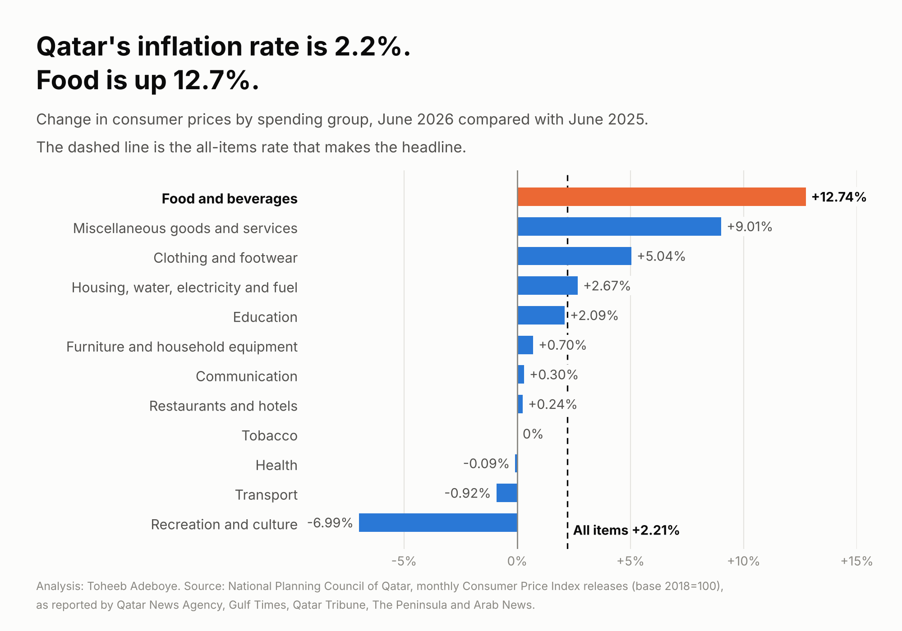
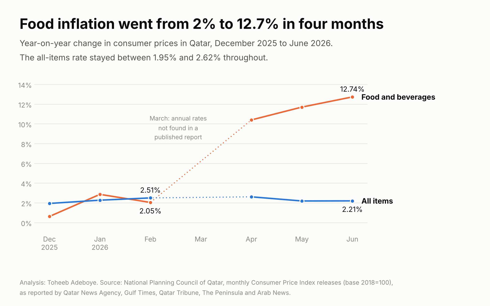
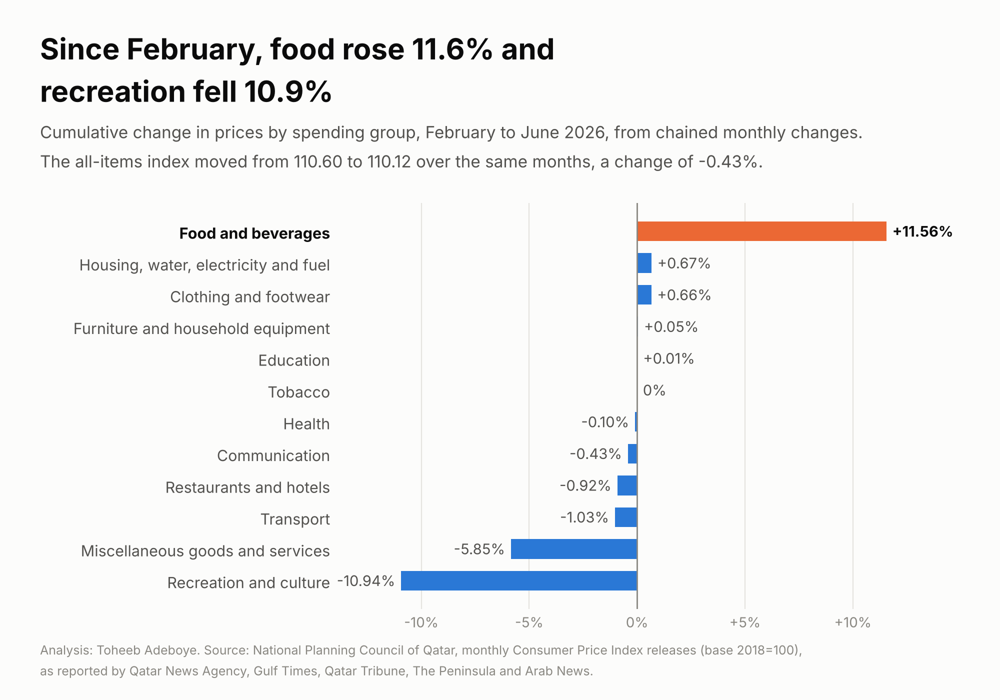

# Qatar Food Inflation

**Qatar's inflation rate was 2.21% in June 2026. How different is the picture for food, and when did the gap open?**

[Notebook](notebooks/qatar_food_inflation_analysis.ipynb) · [SQL](sql/analysis_queries.sql) · [Data dictionary](docs/data_dictionary.md) · [Tidy data](data/processed/qatar_cpi_tidy.csv)



## Contents

1. [Project background](#project-background)
2. [Questions](#questions)
3. [Executive summary](#executive-summary)
4. [Insights](#insights)
5. [Recommendations](#recommendations)
6. [Data](#data)
7. [Method](#method)
8. [Tools](#tools)
9. [Repository structure](#repository-structure)
10. [How to reproduce](#how-to-reproduce)
11. [Assumptions and limitations](#assumptions-and-limitations)
12. [Sources](#sources)
13. [Author](#author)

## Project background

Every month the National Planning Council of Qatar publishes the Consumer Price Index. News reports lead with one number, the all-items annual rate. That rate has stayed close to 2% through the first half of 2026.

The all-items rate is an average over twelve spending groups, each weighted by its share of household spending. A household that spends more of its budget on groceries than the average household does will see a different rate from the one in the headline. This project reads the group figures behind the headline for December 2025 to June 2026 and asks how far food has moved away from the average.

The index used here has 2018 as its base year. From the July 2026 release the Council moved to a 2024 base year with a new classification and new weights, so June 2026 is the last month of the series analysed here.

## Questions

1. In June 2026, how does the annual change in food prices compare with the all-items rate and with the other spending groups?
2. In which month did food prices move away from the rest?
3. If food rose that much, which groups fell by enough to keep the all-items rate near 2%?

## Executive summary

Food and beverage prices in Qatar were 12.74% higher in June 2026 than in June 2025. The all-items rate for the same month was 2.21%. In February 2026 the food rate had been 2.05%, slightly below the all-items rate. Most of the change came in one month: food prices rose 6.9% between February and March. From February to June food rose 11.6% while the all-items index fell 0.43%, because recreation and culture, miscellaneous goods and services, transport and restaurants and hotels became cheaper over the same months.

| Measure | Value | Period | Checked in |
|---|---|---|---|
| Food and beverages, annual change | +12.74% | June 2026 | Four publishers |
| All items, annual change | +2.21% | June 2026 | Three publishers |
| Food and beverages, annual change four months earlier | +2.05% | February 2026 | Two publishers |
| Food and beverages, change in one month | +6.9% | March 2026 | One publisher |
| Food and beverages, cumulative change | +11.6% | February to June 2026 | Derived from monthly changes |
| All-items index | 110.60 to 110.12 (-0.43%) | February to June 2026 | Two publishers |
| Recreation and culture, annual change | -6.99% | June 2026 | Three publishers |



## Insights

### 1. Food is rising almost six times as fast as the headline rate

In June 2026 four of the twelve groups rose faster than the all-items rate and eight rose more slowly or fell.

| Spending group | Annual change, June 2026 |
|---|---|
| Food and beverages | +12.74% |
| Miscellaneous goods and services | +9.01% |
| Clothing and footwear | +5.04% |
| Housing, water, electricity and fuel | +2.67% |
| **All items** | **+2.21%** |
| Education | +2.09% |
| Furniture and household equipment | +0.70% |
| Communication | +0.30% |
| Restaurants and hotels | +0.24% |
| Tobacco | 0.00% |
| Health | -0.09% |
| Transport | -0.92% |
| Recreation and culture | -6.99% |

The gap between food and the all-items rate is 10.53 percentage points.

### 2. The gap opened in March 2026

| Month | Food, annual change | All items, annual change | Food, change on previous month |
|---|---|---|---|
| December 2025 | +0.63% | +1.95% | +0.19% |
| January 2026 | +2.87% | +2.28% | -0.59% |
| February 2026 | +2.05% | +2.51% | +0.16% |
| March 2026 | not found | not found | +6.9% |
| April 2026 | +10.41% | +2.62% | +1.48% |
| May 2026 | +11.71% | +2.2% | +1.84% |
| June 2026 | +12.74% | +2.21% | +0.98% |

Until February food was moving with the average. Between February and April the annual food rate went from 2.05% to 10.41%, and it has risen in each month since. The all-items rate stayed between 1.95% and 2.62% for the whole period. March 2026 was the first full month after the regional conflict began on 28 February 2026. The CPI release does not attribute the rise to a cause, and this analysis does not test one.

### 3. Cheaper recreation and transport offset dearer food in the average



From February to June 2026 food rose 11.56% and housing and utilities rose 0.67%. Over the same four months recreation and culture fell 10.94%, miscellaneous goods and services fell 5.85%, transport fell 1.03% and restaurants and hotels fell 0.92%. The all-items index went from 110.60 to 110.12.

So the headline did not stay low because prices were stable. It stayed low because a large rise in one group and falls in several others cancelled out. A household's own rate depends on which of those groups it spends on.

### 4. The food result does not depend on the starting month. The recreation result does.

| Group | February to June 2026 | December 2025 to June 2026 |
|---|---|---|
| Food and beverages | +11.56% | +11.08% |
| Recreation and culture | -10.94% | -22.08% |
| All items | -0.43% | -2.02% |

Recreation and culture rose 6.84% in December and fell 11.97% in January, a seasonal pattern. A window that starts in December exaggerates its fall. For that group the annual figure, -6.99%, is the safer one to quote.

## Recommendations

**For households in Qatar planning a budget:** use the food rate, not the all-items rate, for the grocery line. A grocery budget set in February 2026 would need about 11.6% more by June to buy the same basket, on the official index.

**For employers and HR teams reviewing allowances:** a cost-of-living adjustment pegged to the 2.21% headline does not cover the rise in food costs. Staff on lower salaries usually spend a larger share of income on food, so they are more exposed to the group that rose most. The CPI does not publish rates by income level, so this is a reason to look at the group figures, not a measured result.

**For analysts and journalists reporting the monthly CPI:** report the food rate next to the all-items rate while the two are this far apart, and take care with comparisons across June and July 2026, because the base year, classification and weights changed.

## Data

| File | Rows | Contents |
|---|---|---|
| `data/raw/qatar_cpi_readings_by_source.csv` | 361 | Every figure read from every report, one row per figure per publisher, with link |
| `data/raw/qatar_cpi_quarterly_check.csv` | 2 | First-quarter 2026 index and annual rate, used as a cross-check |
| `data/processed/qatar_cpi_tidy.csv` | 187 | One row per month, group and measure, with the number of publishers behind it |
| `data/processed/cumulative_change_by_group.csv` | 30 | Cumulative change per group for two windows |

Coverage: Qatar, seven months (December 2025 to June 2026), twelve CPI spending groups plus the all-items index and the index excluding housing and utilities. Three measures: index level, change on the previous month, change on the same month a year earlier.

Checks done by `scripts/build_data.py`, which stops with an error if any fails:

- No duplicate reading from the same publisher, no unknown group names, no missing values.
- Every figure reported by more than one publisher is the same in each. 163 of 187 figures are confirmed this way and none disagree.
- The published index level each month equals the previous level times one plus the published monthly change. Largest gap: 0.009 index points.
- The average of the January, February and March index levels (110.65) equals the index in the separate first-quarter release (110.65).
- The cumulative all-items change from chained monthly changes (-0.44%) matches the change from published index levels (-0.43%).

Figures that rest on one publisher are listed under [Assumptions and limitations](#assumptions-and-limitations).

## Method

The annual and monthly changes are the official published figures. Nothing is estimated or interpolated, and months without a published figure are left empty.

The cumulative change is the one derived measure. It chains the published monthly changes, which is the standard way to link index movements over several periods:

```
cumulative_change = (1 + m1/100) x (1 + m2/100) x ... x (1 + mn/100) - 1

Food, February to June 2026:
(1 + 0.069) x (1 + 0.0148) x (1 + 0.0184) x (1 + 0.0098) - 1 = 0.1156 = 11.56%

Index identity used as a check:
index(t) = index(t-1) x (1 + monthly_change(t)/100)
```

Because each monthly change is rounded before publication, the food result lies between 11.49% and 11.63%. It is quoted as 11.6%.

## Tools

- Python (pandas) for the build script and checks
- matplotlib for the charts
- SQL (SQLite) for the queries in `sql/analysis_queries.sql`
- Jupyter notebook for the walk-through

## Repository structure

```
qatar-food-inflation/
  README.md
  requirements.txt
  data/raw/qatar_cpi_readings_by_source.csv
  data/raw/qatar_cpi_quarterly_check.csv
  data/processed/qatar_cpi_tidy.csv
  data/processed/cumulative_change_by_group.csv
  notebooks/qatar_food_inflation_analysis.ipynb
  scripts/build_data.py
  scripts/make_charts.py
  sql/analysis_queries.sql
  images/
  docs/data_dictionary.md
```

## How to reproduce

```
pip install -r requirements.txt
python scripts/build_data.py     # checks the raw readings and writes data/processed
python scripts/make_charts.py    # writes the charts to images/
jupyter notebook notebooks/qatar_food_inflation_analysis.ipynb
```

To run the SQL, load the two processed CSV files into SQLite as tables `qatar_cpi` and `cumulative`.

## Assumptions and limitations

- **The figures come from news reports of the official release, not from the Council's own tables.** The Council's website could not be read directly when the data was collected. Two outlets printing the same number shows the number was transcribed correctly from the release. It is not two independent measurements.
- **March 2026 rests on one publisher.** All fourteen monthly changes for March, including the 6.9% rise in food, come from one Arab News report, which prints the food figure to one decimal. The March all-items index is confirmed by the index identity and by the first-quarter average. The food figure is consistent with the two-publisher annual rates for February and April (see the notebook, section 5) but is not confirmed directly.
- **No annual rates for March 2026** were found in a published report. They are left empty.
- **Five annual rates for May 2026** (all items, clothing, housing, recreation and transport) come from one publisher, FocusEconomics, at one decimal. The May food rate, 11.71%, is confirmed at one decimal by a second publisher.
- **The December 2025 figures for the index excluding housing** come from one publisher.
- **Group weights were not used.** The contribution of each group to the all-items rate cannot be calculated from these figures alone, so the offsetting described in Insight 3 is shown by direction and size of change, not as contributions in percentage points.
- **The CPI is an average basket.** It does not describe any one household, and it is not published by income level or nationality.
- **Not seasonally adjusted.** The February to June comparison covers different months of the year, so it carries seasonal effects, most visibly in recreation and culture. Annual rates do not have this problem.
- **The cause is not tested.** The timing of the food rise follows the start of the regional conflict on 28 February 2026, but nothing in this data separates that from other causes.
- **The series ends in June 2026.** The July 2026 release uses a 2024 base year, the COICOP 2018 classification and new weights. Its levels and group names are not comparable with the figures here without linked back-series.

## Sources

National Planning Council of Qatar, monthly Consumer Price Index releases, December 2025 to June 2026, as reported by:

- Qatar Tribune: [December 2025](https://www.qatar-tribune.com/article/214335/business/qatar-cpi-rises-195-yoy-in-december-2025), [January 2026](https://www.qatar-tribune.com/article/220274/business/qatar-cpi-rises-228-yoy-in-jan-2026), [February 2026](https://www.qatar-tribune.com/article/224689/business/qatar-cpi-rises-251-y-o-y-in-february-2026), [April 2026](https://www.qatar-tribune.com/article/234970/business/qatar-cpi-eases-by-074-in-april-2026), [May 2026](https://www.qatar-tribune.com/article/240104/business/qatars-cpi-edges-down-051-in-may-on-lower-transport-costs), [June 2026](https://www.qatar-tribune.com/article/247337/latest-news/qatars-consumer-prices-rise-221-year-on-year-in-june/amp)
- The Peninsula: [December 2025](https://s.thepeninsula.qa/article/16/01/2026/qatar-cpi-records-nearly-2-rise-in-dec-2025), [January 2026](https://thepeninsulaqatar.com/article/19/02/2026/qatar-cpi-rises-228-yoy-in-january), [February 2026](https://thepeninsulaqatar.com/article/18/03/2026/qatar-cpi-rises-251-y-o-y-in-febuary-2026), [June 2026](https://thepeninsulaqatar.com/article/05/08/2026/consumer-price-index-rises-221-y-o-y-in-june-2026)
- Qatar News Agency: [first quarter 2026](https://qna.org.qa/en/News-Area/News/2026-5/12/qatar-cpi-rises-298-year-on-year-in-q1-2026), [April 2026](https://qna.org.qa/en/News-Area/News/2026-5/18/qatar-cpi-declines-by-074-in-april-2026-1), [May 2026](https://qna.org.qa/en/News-Area/News/2026-6/18/consumer-price-index-for-may-2026-records-a-monthly-decrease-of-051), [July 2026 and the change of base year](https://qna.org.qa/en/News-Area/News/2026-9/29/qatars-consumer-price-index-rises-in-july-2026)
- Arab News: [March 2026](https://www.arabnews.com/node/2641714/amp), [April 2026](https://www.arabnews.com/node/2644020/amp)
- Gulf Times: [June 2026](https://www.gulf-times.com/article/730540/business/qatars-consumer-price-index-rises-221-in-june)
- FocusEconomics: [May 2026](https://www.focus-economics.com/countries/qatar/news/inflation/qatar-consumer-prices-e-19-06-2026-inflation-slows-in-may-from-april/)
- Trading Economics: [Qatar food inflation](https://tradingeconomics.com/qatar/food-inflation)

## Author

**Toheeb Adeboye**, Data Analyst, Doha, Qatar. [LinkedIn](https://www.linkedin.com/in/dtsquarea/)
