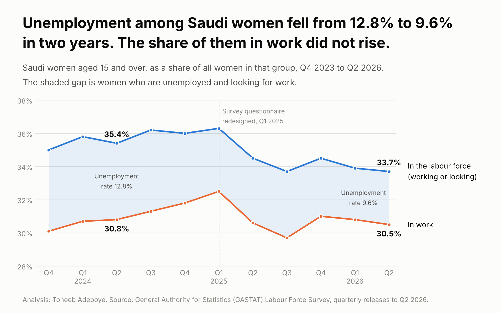
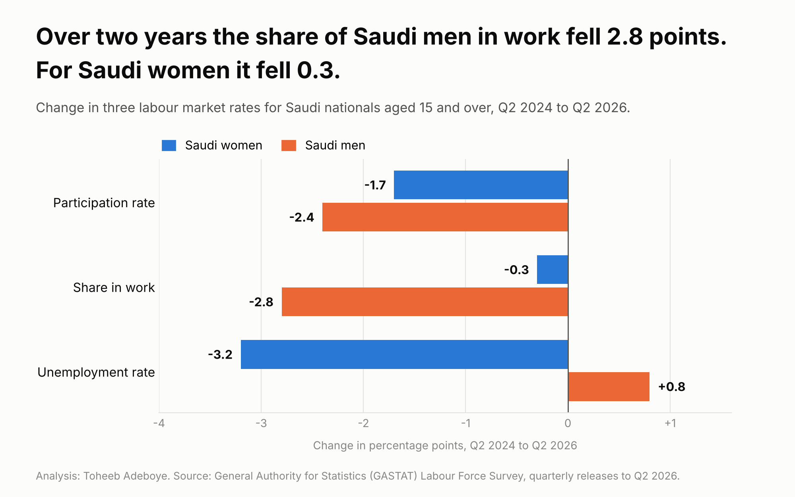
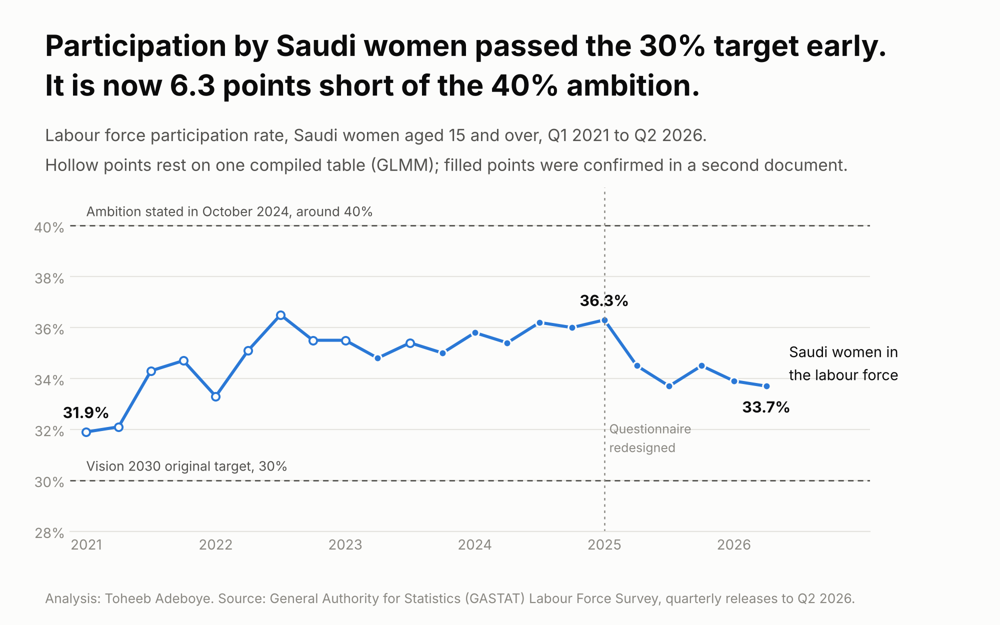

# Saudi Women in Work

**Unemployment among Saudi women has fallen for two years. Are more Saudi women working, or are fewer looking for work?**

[Analysis notebook](notebooks/saudi_women_work_analysis.ipynb) · [SQL queries](sql/analysis_queries.sql) · [Data dictionary](docs/data_dictionary.md) · [Tidy data](data/processed/saudi_labour_tidy.csv)



## Contents

1. [Project background](#project-background)
2. [Questions](#questions)
3. [Executive summary](#executive-summary)
4. [Insights](#insights)
5. [Recommendations](#recommendations)
6. [Data](#data)
7. [Method](#method)
8. [Tools](#tools)
9. [Repository structure](#repository-structure)
10. [How to reproduce](#how-to-reproduce)
11. [Assumptions and limitations](#assumptions-and-limitations)
12. [Sources](#sources)
13. [Author](#author)

## Project background

Saudi Arabia's statistics authority, GASTAT, published its labour market figures for the second quarter of 2026 on 30 September. The unemployment rate among Saudi women was 9.6%, down from 12.8% two years earlier.

An unemployment rate can fall in two ways. More people can find work, or fewer people can look for it. The rate alone does not say which. The same survey publishes two other rates that do: the participation rate (working or looking) and the employment-to-population ratio (working). This project reads the three together for Saudi women and Saudi men.

## Questions

1. Did the share of Saudi women in work rise while their unemployment rate fell?
2. How much of the fall in the unemployment rate is explained by lower participation?
3. Is the pattern the same for Saudi men?
4. How far is women's participation from the stated ambition of around 40% by 2030?

## Executive summary

Between the second quarter of 2024 and the second quarter of 2026, the unemployment rate among Saudi women fell by 3.2 points. Over the same two years the share of Saudi women in work went from 30.8% to 30.5%. The fall in unemployment came from fewer women being in the labour force: participation dropped from 35.4% to 33.7%.

If participation had stayed at 35.4%, the same level of employment would give an unemployment rate of **13.8%** instead of the published 9.6%.

| Saudi nationals aged 15 and over | Q2 2024 | Q2 2026 | Change |
|---|---|---|---|
| Women: unemployment rate | 12.8% | 9.6% | -3.2 points |
| Women: share in work | 30.8% | 30.5% | -0.3 points |
| Women: participation rate | 35.4% | 33.7% | -1.7 points |
| Men: unemployment rate | 4.0% | 4.8% | +0.8 points |
| Men: share in work | 63.6% | 60.8% | -2.8 points |
| Men: participation rate | 66.3% | 63.9% | -2.4 points |

The direction of this result holds on shorter windows. Its size does not, because GASTAT changed the survey questionnaire in the first quarter of 2025. See insight 4.

## Insights

### 1. The unemployment rate fell, the share in work did not rise

| Saudi women | Participation | In work | Unemployment rate | Unemployed, share of all women |
|---|---|---|---|---|
| Q2 2024 | 35.4% | 30.8% | 12.8% | 4.6% |
| Q1 2025 | 36.3% | 32.5% | 10.5% | 3.8% |
| Q2 2025 | 34.5% | 30.6% | 11.3% | 3.9% |
| Q1 2026 | 33.9% | 30.8% | 9.0% | 3.1% |
| Q2 2026 | 33.7% | 30.5% | 9.6% | 3.2% |

The share of Saudi women in work peaked at 32.5% in the first quarter of 2025 and has been between 29.7% and 31.0% since. Unemployed women went from 4.6% of all Saudi women to 3.2%. They left the count of the unemployed, but the count of the employed did not grow as a share of the population.

### 2. Lower participation accounts for all of the fall

At the participation rate of two years ago, today's employment level would mean an unemployment rate of 13.8%, a point higher than the starting 12.8%. Participation at 33.7% is level with the third quarter of 2025 and otherwise the lowest since the first quarter of 2022.

### 3. For Saudi men, the share in work fell further

The share of Saudi men in work fell 2.8 points in two years, against 0.3 for women. Men's participation fell by 2.4 points, which kept their unemployment rate from rising further than it did. At unchanged participation it would be 8.3% and not 4.8%.



### 4. The size of the result depends on the window, the direction does not

| Window | Women: participation | Women: share in work | Women: unemployment rate |
|---|---|---|---|
| Two years, Q2 2024 to Q2 2026 | -1.7 | -0.3 | -3.2 |
| One year, Q2 2025 to Q2 2026 | -0.8 | -0.1 | -1.7 |
| Since the redesign, Q1 2025 to Q2 2026 | -2.6 | -2.0 | -0.9 |

Changes are in percentage points. The one-year window sits entirely on the new questionnaire and compares the same season. It is the most cautious reading: unemployment down 1.7 points, share in work unchanged within rounding.

### 5. Participation is 6.3 points short of the 40% ambition

Saudi women's participation passed the original Vision 2030 target of 30% years early. In October 2024 the finance minister said the country was now aiming for around 40% by 2030. At 33.7% the rate is 6.3 points below that, a wider gap than in any second quarter since 2022.



## Recommendations

These follow from the data and are aimed at people who read or use labour market figures. They are not policy advice.

- **Anyone reading a jobs headline:** read the unemployment rate together with the share in work. For Saudi women the first improved by 3.2 points while the second did not improve at all.
- **Employers and recruiters hiring Saudi nationals:** a lower unemployment rate here does not mean a tighter pool of candidates. About two in three Saudi women aged 15 and over are outside the labour force, and that share grew over the two years studied.
- **Analysts tracking the 2030 targets:** track participation and the employment ratio every quarter and compare the same quarter a year apart. Avoid comparing across the first quarter of 2025 without a note on the questionnaire change.
- **Next steps for this analysis:** add the age breakdown (15 to 24, 25 to 54, 55 and over) to see where participation fell, add the third quarter of 2023 to complete the series, and update when the third quarter of 2026 is released.

## Data

Quarterly Labour Force Survey rates for Saudi Arabia, first quarter of 2021 to second quarter of 2026. All figures come from public documents.

| File | Rows | Contents |
|---|---|---|
| `data/processed/saudi_labour_tidy.csv` | 160 | One row per quarter, nationality, sex and indicator, with a verification flag. The main analysis table |
| `data/processed/window_comparisons.csv` | 6 | Start-to-end changes for women and men over three windows |
| `data/raw/saudi_labour_readings_by_source.csv` | 337 | Every figure as read from each of 15 documents, with source link |

Column definitions are in the [data dictionary](docs/data_dictionary.md).

**Groups covered.** Saudi nationals: women, men and total, three indicators. Non-Saudi women: participation only, used to check the effect of the 2025 questionnaire change.

**Data checks.**

- No missing values, no duplicate rows and no value outside 0 to 100 in the analysis table.
- Where two documents report the same figure they agree in every case. The build script stops if they do not.
- The three rates satisfy the identity `employment ratio = participation x (1 - unemployment rate)` to within 0.08 of a point in all 36 quarter and sex combinations, which guards against a misread digit.
- Of the 138 Saudi figures, 53 are confirmed by two publishers, 32 by two separate GASTAT releases and 53 rest on one document. Every figure in the executive summary table is confirmed in at least two documents except the Q2 2026 share in work for women (30.5%) and for men (60.8%), which come from the Q2 2026 release alone and pass the identity check.

## Method

Labour force identity, as defined by the International Labour Organization and used by GASTAT:

```
participation rate  = (employed + unemployed) / population aged 15 and over
employment ratio    = employed / population aged 15 and over
unemployment rate   = unemployed / (employed + unemployed)
                    = 1 - employment ratio / participation rate

unemployment rate at unchanged participation
                    = 1 - employment ratio at end / participation rate at start
```

- **Headline window:** second quarter of 2024 to second quarter of 2026. The same quarter is compared so that seasonal patterns do not enter.
- **Sensitivity:** the comparison is repeated for one year (Q2 2025 to Q2 2026) and from the first redesigned quarter (Q1 2025 to Q2 2026). All three are reported.
- **Verification:** each figure is collected from every document that reports it, and the tidy table records how many documents and publishers agree.

## Tools

| Tool | Used for |
|---|---|
| Python (pandas, matplotlib) | Cross-checking sources, building the tidy table, window comparisons, notebook analysis and charts |
| SQL (SQLite) | Pivot, year-on-year, ranking and verification queries on the tidy table |
| Git and GitHub | Version control and publishing |

The tidy CSV is shaped to load directly into Power BI or Tableau.

## Repository structure

```
saudi-women-workforce/
├── README.md
├── requirements.txt
├── data/
│   ├── raw/                    Every reading with its source link
│   └── processed/              Analysis-ready tables
├── notebooks/
│   └── saudi_women_work_analysis.ipynb
├── scripts/
│   ├── build_data.py           Cross-checks sources and builds processed data
│   └── make_charts.py          Draws the three charts
├── sql/
│   └── analysis_queries.sql
├── images/                     Charts
└── docs/
    └── data_dictionary.md
```

## How to reproduce

```bash
git clone https://github.com/dtsquarea12/DATA-ANALYST-PROJECT.git
cd DATA-ANALYST-PROJECT/saudi-women-workforce
pip install -r requirements.txt
python scripts/build_data.py
python scripts/make_charts.py
jupyter notebook notebooks/saudi_women_work_analysis.ipynb
```

The notebook recomputes the headline figures and asserts that they match the build script's output, so the two cannot drift apart.

## Assumptions and limitations

- **Questionnaire change.** GASTAT redesigned the Labour Force Survey questionnaire and drew a new sample in the first quarter of 2025. Participation of non-Saudi women moved from 27.9% to 36.7% in that one quarter, which shows the change affected measured rates. Comparisons across that quarter, including the two-year headline, carry this caveat.
- **No margins of error.** The releases used give rates to one decimal without confidence intervals. Changes of a few tenths of a point, such as the 0.3 point fall in women's share in work, should be read as no change.
- **Rounded inputs.** The 13.8% and 8.3% figures are calculated from published rates rounded to one decimal and could differ by about 0.2 of a point from a calculation on unrounded data. They are illustrations of the identity, not forecasts or official figures.
- **Revisions.** Figures up to the first quarter of 2024 were revised by GASTAT on the 2022 census. Older reports quote different numbers for the same quarters, for example 35.5% and not 35.0% for women's participation in the fourth quarter of 2023. This project uses the revised series throughout.
- **Single-source history.** Participation before the second quarter of 2023, and for the third quarter of 2023, comes from one compiled table (GLMM). This includes the series high of 36.5% in the third quarter of 2022.
- **Q2 2026 release.** The Q2 2026 GASTAT release was read from a copy of the PDF hosted by a news site. Its unemployment and participation figures are confirmed by Argaam's report of the same release.
- **The 40% figure** is a minister's statement ("more than 35 percent or around 40 percent by 2030"), reported by Arab News on 30 October 2024. It is used as a reference line, not as a formal target.
- **What is not shown.** The data describe what the rates did. They do not show why participation fell, and this project does not attribute it to any cause.
- Data collected on 6 October 2026.

## Sources

**Official:** General Authority for Statistics (GASTAT), Labor Market Statistics releases for Q2 2024, Q4 2024, Q1 2025, Q2 2025, Q3 2025, Q4 2025 and Q2 2026, and GASTAT news items of 31 December 2024 and 30 September 2025.
**Second sources:** Gulf Labour Markets and Migration programme (GLMM) table of participation rates Q1 2021 to Q3 2025, Argaam, Saudi Press Agency, Jadwa Investment labour market update 2024, vision2030.ai analysis of 31 July 2026.
**Target and ambition:** Arab News, 30 October 2024, report of the finance minister's remarks at the Future Investment Initiative.

Row-level source links are in `data/raw/saudi_labour_readings_by_source.csv`.

## Author

**Toheeb Adeboye**, Data Analyst, Doha, Qatar
[LinkedIn](https://www.linkedin.com/in/dtsquarea/) · [GitHub](https://github.com/dtsquarea12)

Independent analysis of public data. Calculations are the author's and are not official statistics.
